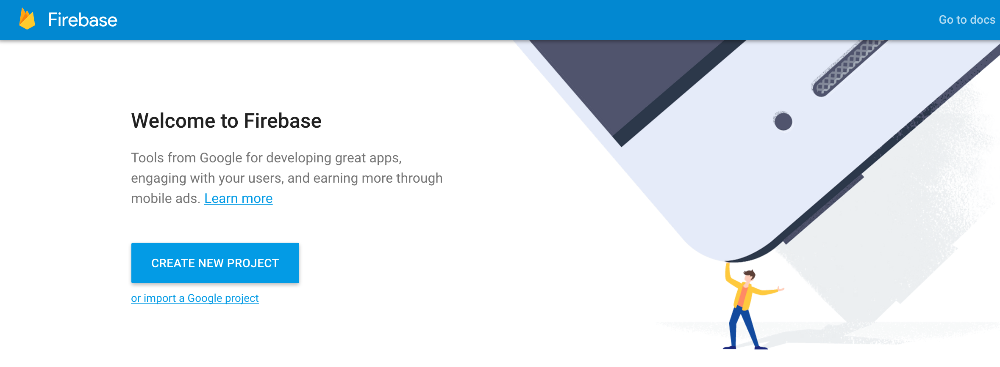
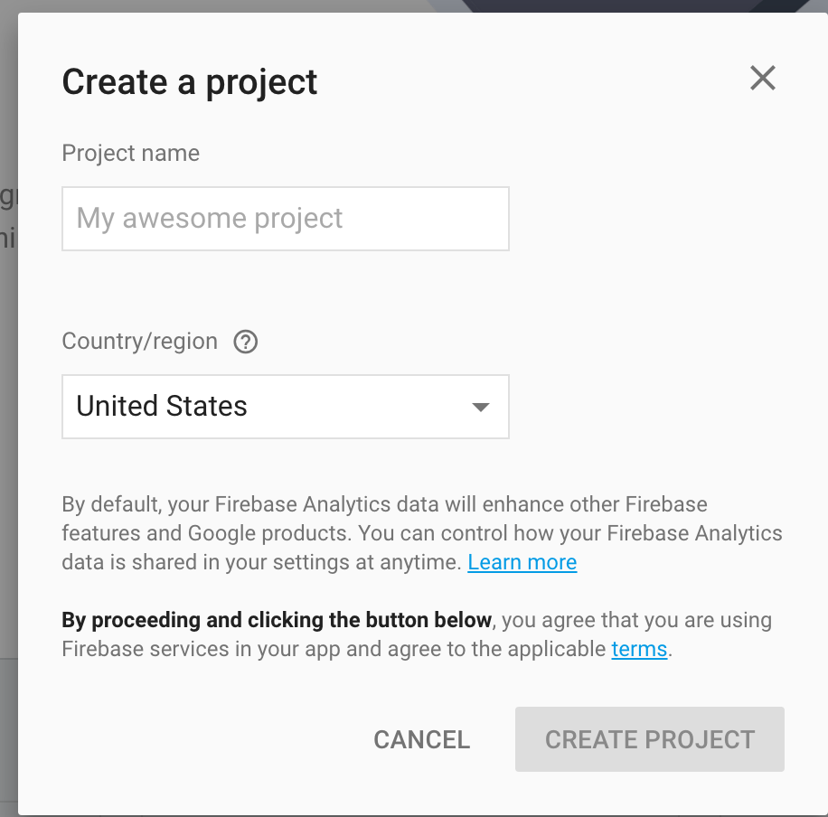
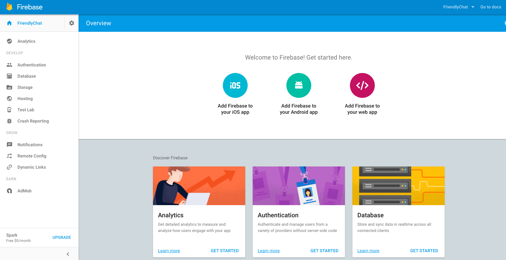
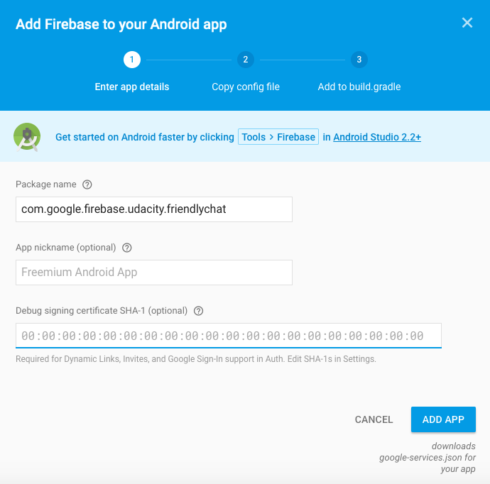
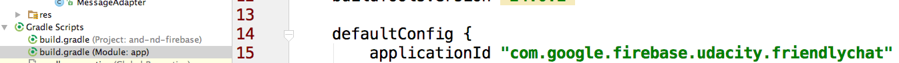
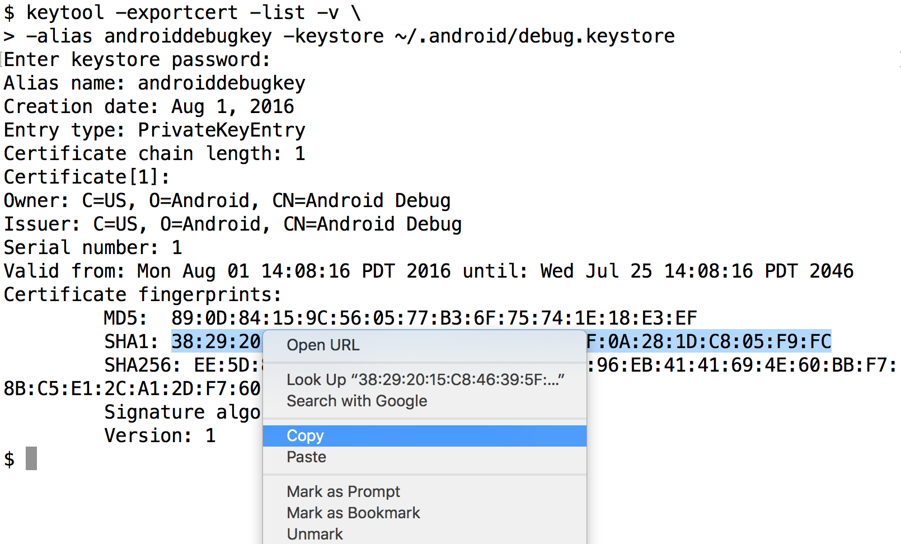
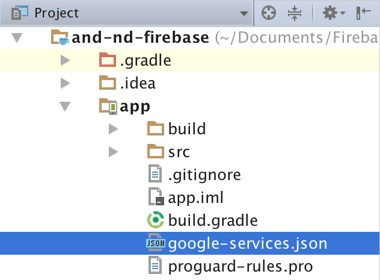
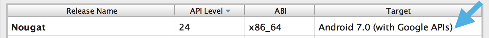

# Firebase in a Week-end

## Saturday

### Download
[repo](https://github.com/udacity/and-nd-firebase)

### Create a Firebase Project
Start by navigating to the [Firebase Console](https://console.firebase.google.com/) webpage.

Select "CREATE NEW PROJECT" and name your project.


In this case, the name of our app is FriendlyChat, so let’s name the project FriendlyChat as well.


Once your project is created, you can see the project’s Overview page.


### Finishing Creating Firebase Project
From the FriendlyChat project page in the Firebase Console, select “Add Firebase to your Android App”. This opens a dialog window that asks for your app’s Package name and the Debug signing certificate SHA-1. It also asks for an optional App Nickname, which you can keep blank.

#### Finding the app's package name


For the package name, paste in ```com.google.firebase.udacity.friendlychat``` so it matches the package name from the FriendlyChat project downloaded earlier. You can find this in your app's build.gradle file:


#### Getting the Debug Certificate
You’ll need to add the debug signing certificate too because you’ll implement Google Sign-In for authentication in FriendlyChat. The SHA-1 is a type of hash representation for the debug keystore, which you can get with the keytool command line tool. Which is a long way of saying, the debug keystore is a bunch of letters and numbers, which you should keep secret, that identifies your computer.

On Windows, open the Command Prompt program. You can do this by going to the Start menu 

```
keytool -exportcert -list -v \
-alias androiddebugkey -keystore %USERPROFILE%\.android\debug.keystore
```

On Mac/Linux, open the Terminal and paste
```
keytool -exportcert -list -v \
-alias androiddebugkey -keystore ~/.android/debug.keystore

```
When prompted to input a password, type ```android``` and then press Enter. Don’t worry if you don’t see any characters appear on the screen when typing the password, as your command line interface is hiding them on purpose.

After you paste the command and press Enter, you’ll see some text output like the following:

Select the string of numbers and colons after the line that’s labeled “SHA-1:” and copy it. Then paste it in the dialog back in the Firebase Console.

#### google-services.json
Once you click “Add App”, a google-services.json file should download automatically. The google-services.json file connects your client-side app with your specific Firebase project that will handle the server-side components of your app.

Once the download is complete, move the google-services.json file to the app directory of the FriendlyChat project. In Android Studio, you can select the “Project” view in the top-left corner of the Project navigation view, and then open the app directory. You can then drag the google-services.json file into the Android Studio project. You should end up with a project file tree like the following screenshot:


#### Finishing 
Firebase on Android requires a device with a recent version of Google Play Services. Most physical devices should work properly.

For emulated devices, ensure that the installation of Android tools in the SDK Manager are fully up to date. See the documentation to ["Update Your Tools with the SDK Manager"](https://developer.android.com/studio/intro/update#sdk-manager) for more information. Specifically, you'll need to have the "Google API" system images for the emulator you'll be running. When creating an Android virtual device to use, double check that it says "(with Google APIs)" in the target column, meaning it has Google Play Services installed.

For example, to set up an Android Nougat emulator (Android 7.0, API 24), we can open the AVD Manager and select the AVD labeled "(with Google APIs)" in the target section when creating a virtual device.



### Add Firebase SDK
[Documentation](https://firebase.google.com/docs/android/setup)

### Why Firebase RealTime Database
- synchronize data: all connected devices receive the change within milliseconds
- responsive if the user is offline: the change is store locally

Multi-user, collaborative and real-time.

### Database Structure

All data is stored as JSON objects.


If you'd like to learn more about JSON, check out the following resource:

- [Android Basics JSON Videos](https://classroom.udacity.com/courses/ud843/lessons/1335cf7d-bb4f-48c6-8503-f14b127d2abc/concepts/cf8cd625-1fef-4d03-991b-2808a3ddb47c#)
- [JSON overview from W3schools](https://www.w3schools.com/js/js_json_intro.asp)

If you have extra time this weekend, you can learn more about push IDs at The Firebase Blog: [The 2^120 Ways to Ensure Unique Identifiers](https://firebase.googleblog.com/2015/02/the-2120-ways-to-ensure-unique_68.html)

### Database Implementation - Writing 1

In build.gradle app, add ```compile 'com.google.firebase:firebase-database:9.6.1'```

Re-sync.

In MainActivity, create instance variables:
```java
// Firebase object, entry point for the app to access the database
private FirebaseDatabase mFirebaseDatabase;
// Databese reference object, referencing the messages portion of the database
private DatabaseReference mMessageDatabaseReference;
```
In onCreate method, instantiate the two objects:
```java
mFirebaseDatabase = FirebaseDatabase.getInstance();
mMessagesDatabaseReference = mFirebaseDatabase.getReference().child("messages");
```

### Database Implementation - Writing 2

Let’s implement message sending in the app.

To do so, we’ll add a click listener to the send button:
```java
// Send button sends a message and clears the EditText
mSendButton.setOnClickListener(new View.OnClickListener() {
   @Override
   public void onClick(View view) {
       // TODO: Send messages on click


       // Clear input box
       mMessageEditText.setText("");
   }
});
```

Within the onClick method, let’s create a FriendlyMessage object for the message that the user typed in. The FriendlyMessage object has three instance variables: A String for the user’s name, A String for the text of the message A String for the URL of the photo if it’s a photo message.

In this case, we’re only sending text messages for now (we will implement photo-messaging later), so we’ll create a FriendlyMessage object with all the fields except for ```photoUrl```, which will be ```null```.

```java
FriendlyMessage friendlyMessage = new FriendlyMessage(mMessageEditText.getText().toString(), mUsername, null);
```

This object has all the keys that we’ll store as a message in the realtime database. In the next step we’ll store this data to the cloud in our realtime database.

[Save Data on Android](https://firebase.google.com/docs/database/android/read-and-write)

Add
```
mMessagesDatabaseReference.push().setValue(friendlyMessage);
```
### Database Implementation - reading

IN MainActivity, onCreate method:
```java
private ChildEventListener mChildEventListener;

preotected void onCreate(Bundle savedInstanceState){
    ...
     mChildEventListener = new ChildEventListener() {
        @Override
        public void onChildAdded(DataSnapshot dataSnapshot, String s) {
            FriendlyMessage friendlyMessage = dataSnapshot.getValue(FriendlyMessage.class);
            mMessageAdapter.add(friendlyMessage);
        }

        public void onChildChanged(DataSnapshot dataSnapshot, String s) {}
        public void onChildRemoved(DataSnapshot dataSnapshot) {}
        public void onChildMoved(DataSnapshot dataSnapshot, String s) {}
        public void onCancelled(DatabaseError databaseError) {}
        };
mMessagesDatabaseReference.addChildEventListener(mChildEventListener);
}
```

If you'd like to see an example of objects in Firebase, the [read and write documentation](https://firebase.google.com/docs/database/android/read-and-write#basic_write) for Android has an example with the User class.

### Database Security Rules

Remember the database rules we changed? We made it so anyone can read and write data without checking authentication.


Let’s change it back to the default rules, which means that users need to be authenticated to read and write data. These rules are enforced by the Firebase servers. So there is no way for our users to bypass the rules that we set.


These rules are a good starting point for a simple chat app like FriendlyChat, but there are certainly plenty of cases where we will want to further restrict access. Let’s examine how Firebase Database security rules make this possible.

#### Rule Types

Firebase allows three main rule types: .read, .write. And .validate. Each of these can be set to “true” or “false” and can apply to the whole database or a particular location in the database depending on how they are configured.

|Rule Type |	Description|
|.read |	Describes whether data can be read by the user.
|.write |	Describes whether data can be written by the user.
|.validate |	Defines what a correctly formatted value looks like, whether it has child nodes, and the data type.

#### Predefined Variables

Firebase Database Security includes a set of predefined variables that enable you to customize data accessibility. Below is a list of predefined variables and a link to each API reference. 

|Variable| 	Description|
|now |	The current time in milliseconds since Unix epoch time (January 1, 1970)|
|root |	Corresponds to the current data at the root of the database. You can use this to read any data in your database in your rule expressions.|
|newData |	Corresponds to the data that will result if the write is allowed|
|data |	Corresponds to the current data in Firebase Realtime Database at the location of the currently executing rule.|
|$variables | 	A wildcard path used to represent ids and dynamic child keys.|
|auth |	Contains the token payload if a user is authenticated, or null if the user isn't authenticated.|

We will expand on the auth variable because we will use it in database security examples.

#### Auth

The auth variable contains the JSON web token for the user. A JSON Web Token is a standard that defines a way of securely transmitting information between parties, like the database and a client, as a JSON object. Once a user is authenticated, this token contains the provider, the uid, and the Firebase Auth ID token.

The provider is the method of authentication, such as email/password, Google Sign In, or Facebook Login.

The uid is a unique user ID. This ID is guaranteed to be unique across all providers, so a user that authenticates with Google and a user that authenticates with email/password do not risk having the same identification.

The Firebase Auth ID is a web token. Yes, this means that there is a web token inside of the Auth web token! This token can contain the following data:

|Data| 	Description|
|email |	The email address associated with the account.|
|email_verified |	A boolean that is true if the user has verified they have access to the email address. Some providers automatically verify email addresses. You can customize authentication to include email verification for email/password on iOS.|
|name |	The user’s display name, if one is set.|
|sub |	The user’s Firebase uID.|
|firebase.identities |	Dictionary of all the identities that are associated with this user's account.|
|firebase.sign_in_provider |	The sign-in provider used to obtain this Firebase Auth ID token.|

### Advanced Database Rules

#### Advanced Rules

Sometimes, we don’t want to apply a rule to all users of an app. We may want to have administrative access for some users, allowing them to access data that other users cannot. We may want to unlock features stored in the database when users reach some target, like number of messages sent. We may want to add premium features to our app that only paying customers can access. Let’s look at how we can use group-specific rules to enforce premium feature access.

For FriendlyChat we could, for example, give paying customers access to private chat rooms. We'll want to configure the database to include a child of messages that will contain the messages from this special chat, and rules so that only the users who paid for the service can access private chat rooms. We will use .read and .write rules to control access those chat rooms. Let’s compare the structure of a FriendlyChat database that includes private chat rooms under the key “special_chat” to the structure of the rules restricting that database.

**Database:**
```json
{
 "chat": {
   "messages": {
     "-KS3PV-iwUZp5wkNq70s": {
       "name": "person1",
       "text": "hey!"
     },
     "-KS3PXhIhs8J_inrExy4": {
       "name": "person2",
       "text": "what’s up?"
     }
   }
 },
 "special_chat": {
   "messages": {
     "-KR-DwqtKzlWGxSn9P0y": {
       "name": "person1",
       "text": "Want to go to the movies?"
     },
     "-KR4tIpWmNn-EYxquSrw": {
       "name": "person3",
       "text": "Yeah! Let’s meet at 7."
     }
   }
 },
 "users": {
   "uid1": {
     "paid": true
   },
   "uid2": {
     "paid": false
   },
   "uid3": {
     "paid": true
   }
 }
}
```

**Database Security Rules:**
```json
{
 "rules": {
   "chat" : {
     "messages" : {
       ".read": "auth != null",
       ".write": "auth != null"
     }
   },
   "special_chat" : {
     "messages": {
       ".read": 
       "root.child('users').child(auth.uid).child('paid').val() === true",
       ".write": 
       "root.child('users').child(auth.uid).child('paid').val() === true"
     }
   }
 }
}
```

This database is different from the one we currently use for FriendlyChat. Instead of one top-level `"messages"` node, there are three top-level nodes.

- `"chat"`: contains a "messages" node. Like in FriendlyChat, this is for normal authenticated chat messages.
- `"special_chat"`: contains a "messages" node. Unlike in FriendlyChat, this should only be accessible by paid users.
- `"users"`: contains user IDs nodes, each with a boolean flag to indicate if the user has paid.

The security rules for this database have a structure similar to that of the database itself.

- `"chat/messages"` has `.read/.write` rules that give access only to authenticated users.
- `"special_chat/messages"` has `.read/.write` rules that only allow access to users with a "paid" value of true in the top-level `"users"` database.

Note that we traverse to `"users"` from using the `root` predefined variable, and we get the current user's uID with `auth.uid`. In this example, we see that the user `uid1` has paid for special_chat access, and the user with `uid2` has not paid for access.

#### Cascading Rules

When `.read` and `.write` rule permissions are evaluate to `true`, this cascades to all of the rule’s children. Only truth is cascading; falseness is not cascading. This means any child of the node that has `true` .read or .write rules is also true. If a parent has .read or .write true, this access cannot be revoked by a child node as shown in this example: 
```json
{
 "chat": {
   "messages": {
     "-KRiMpW5bate5qV0Rt7i": {
       "name": "person1",
       "text": "hey!"
     },
     "-KQWHI_eepS4CGr8-kJd": {
       "name": "person2",
       "text": "what’s up?"
     }
   },
   "admin_blog": {
     "Jan 1": "Welcome to my page",
     "Jan 2": "Enjoying the weather?"
   },
   "special_chat": {
   },
   "users": {
     "uid1": {
       "paid": true
     },
     "uid2": {
       "paid": false
     },
     "uid3": {
       "paid": true
     }
   }
 }
}
```

```json
{
 "rules": {
   "chat" : {
     // allows read and write to /chat/<all children>
     // which includes /chat/messages and /chat/admin_blog
     ".read": "true",
     ".write": "true",


     "admin_blog" : {
       // will not negate the ability of the user to write to the blog
       ".write" : "false"
     }
   }
 }
}
```

Here we have a portion of a Firebase Realtime Database. Inside a section called chat, there are messages in the “messages” path, and and blog entries in the “admin_blog” path. Right now, we want to lock down the blog portion of the database so that nobody can write to it. We wrote rules for chat so that anyone could read or write to it, and then added a specific rule setting “write” to “false” to prevent writing in the “admin_blog”. This rule will not take effect because it is nested inside the “chat” rule that has already set “write” to “true”.

```json
{
   "rules": {
      "chat" : {
         "messages" : {
            // allows read and write to /chat/messages/<all children>
             ".read": "true",
             ".write": "true"
          },
         "admin_blog" : {
            // allows read but not write to /chat/admin_blog/<all children>
            ".read" : "true",
            ".write" : "false"
         }
      }
   }
}
```

This is just one example of how the rules could be corrected to get the desired result. Instead of making the read and write rules true from “chat” parent node, which would cause the rule to cascade down all its children, we can make them true for “messages” and all the children of messages, then set separate rules for “admin_blog” and its children. Since neither “messages” nor “admin_blog” has a higher level of permission, their rules are independent of one another and not affected by cascading.

#### Validate Rule

`.validate` is useful for making sure that the structure or your JSON tree and format of your data matches what you design it to be. For example, validate rules can make sure that every message object contains a "name" and a "text" object and no other data. They can also be used to check that the "name" is a string, and no longer than 100 characters.

```
".validate": "newData.isString() && newData.val().length() < 100"
```

The above example shows a rule where data is only valid if it is a string with a length less than 100.

Unlike .read and .write rules, data must adhere to all validation rules to be allowed. 

#### You're in Control

Your database rules can be very simple or very complex depending on the needs of your app. For FriendlyChat, the database rules will be simple: only authenticated users can read and write chat messages, and each chat message will have a name and either a text or photoUrl nodes. Here are the complete rules we'll use in the app. Copy this into the Firebase console: 
```json
{
 "rules": {
   "messages": {
     // only authenticated users can read and write the messages node
     ".read": "auth != null",
     ".write": "auth != null",
     "$id": {
       // the read and write rules cascade to the individual messages
       // messages should have a 'name' and 'text' key or a 'name' and 'photoUrl' key
       ".validate": "newData.hasChildren(['name', 'text']) && !newData.hasChildren(['photoUrl']) || newData.hasChildren(['name', 'photoUrl']) && !newData.hasChildren(['text'])"
     }
   }
 }
}
```
You can check out the [Database Security Rules documentation](https://firebase.google.com/docs/database/security/) for more information, including examples of the different rules and sample apps you can run.

### FirebaseUI Authentication

Open source librairy that handles the UI flow for authenticating with Firebase.

### Getting started xith FirebaseUI

- [Firebase Authentication documentation](https://firebase.google.com/docs/auth/)
- [FirebaseUI-Android GitHub page](https://github.com/firebase/FirebaseUI-Android)

### Authentication Implementation Steps

You're probably using a newer version of Firebase (9.6.0+) and FirebaseUI for Android – Auth (0.6.0+) compared to the videos. The newer version of FirebaseUI for Android - Auth has additional configuration steps for dependencies and an updated API for adding auth providers. Check out the [FirebaseUI for Android - Auth documentation](https://github.com/firebase/FirebaseUI-Android/blob/master/auth/README.md) for all the details.

### Authentication Overview

In build.gradle app:
```
implementation 'com.google.firebase:firebase-auth:16.0.1'
implementation 'com.firebaseui:firebase-ui-auth:4.0.0'
```

### AuthStateListener and AuthUI


