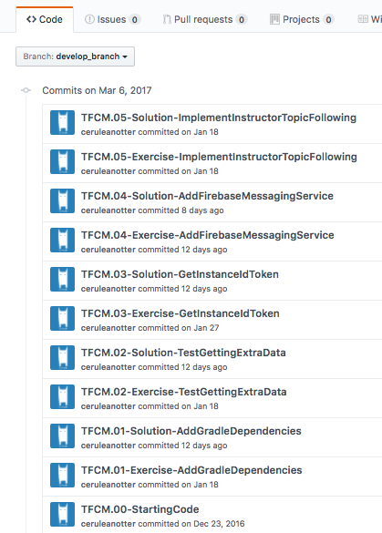
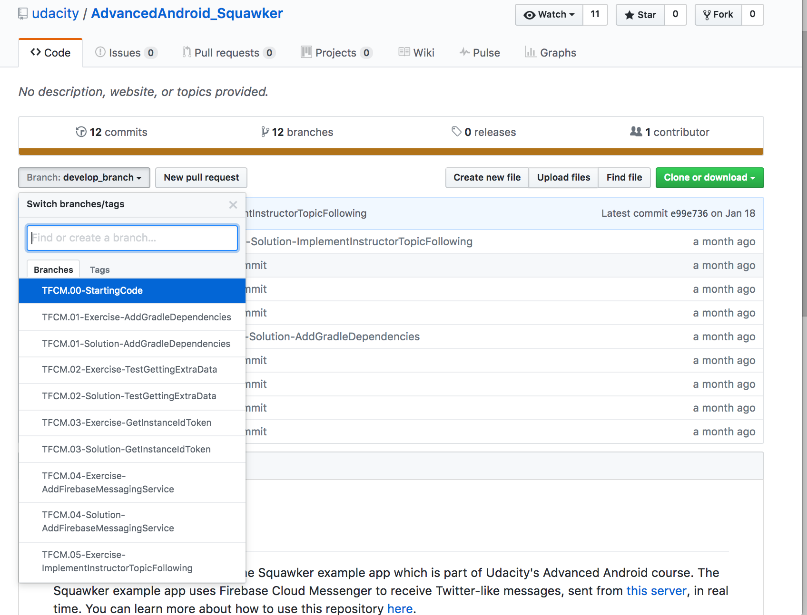

# Lesson 1 - Welcom to Advanced Android

## Guide to the Course Code

Welcome to Advanced Android! In this course, you'll be creating and coding seven different sample apps to learn about the advanced capabilities of Android. They are:

- [AndroidMe](https://github.com/udacity/Android_Me/) - AndroidMe is an app that lets you style your own Android by customizing it's hair and clothing! It uses [Fragments](https://developer.android.com/guide/components/fragments), modular sections of an Activity, to create a flexible and responsive UI.
- [Emojify](https://github.com/udacity/AdvancedAndroid_Emojify) - Emojify is a fun app that turns your face in a selfie into an appropriate Emoji based on your facial expression! This app is your introduction to using libraries.
- [Squawker](https://github.com/udacity/AdvancedAndroid_Squawker/) - Squawker is a social media app where the course instructors send "Squawks" whenever the mood strikes. This app shows new server data in real time, in a battery efficient way.
- [ShushMe](https://github.com/udacity/AdvancedAndroid_Shushme) - ShushMe is an app that turns your device silent whenever you enter any of a list of places of your choice. This app is your introduction to [Geofences](https://developer.android.com/training/location/geofencing).
- [ClassicalMusicQuiz](https://github.com/udacity/AdvancedAndroid_ClassicalMusicQuiz) - This app is simple audio-based quiz where you try to guess the composer by listening to a musical piece! It's your introduction to using [Android Media Players](https://developer.android.com/guide/topics/media/mediaplayer).
- [MyGarden](https://github.com/udacity/AdvancedAndroid_MyGarden) - MyGarden is a plant growing app, you get to add plants to your garden and keep them alive by regularly watering them. This app is your introduction to widgets
- [TeaTime](https://github.com/udacity/AdvancedAndroid_TeaTime) - TeaTime is a mock tea ordering app that demonstrates various uses of the [Espresso Testing framework](https://developer.android.com/training/testing/ui-testing/espresso-testing) (i.e. Views, AdapterViews, Intents, IdlingResources).

### Github

To navigate the code, some familiarity with the version control system Git and the associated website GitHub is required. In general, knowledge of how version control systems (also called a VCS) work is a common prerequisite for developer jobs. Git is also a hugely popular VCS and is used by both Google and Udacity.

If you're not sure what Git or Github are and how to use them, we suggest taking the[ Udacity course](https://eu.udacity.com/course/how-to-use-git-and-github--ud775) about it. There's also plenty of other resources to get you started, such as GitHub's own [interactive tutorial](https://try.github.io/levels/1/challenges/1). To use our repositories, you'll need to be comfortable with the following skills:

- How to clone a GitHub repo
- How to read a diff on GitHub
- What a branch in git is
- How to switch between branches using the checkout command
- How to stage and commit code

### Structure of the Course Code

Each code repository in this class has a chain of commits that looks like this:



These commits show every step you'll take to create the app. They include **Exercise** commits and **Solution** commits. Exercise commits contain instructions for completing the exercise, while solution commits show the completed exercise. You can tell what a commit is by looking at its commit message.

For example, **TFCM.01-Exercise-AddGradleDependencies** is the first code step in the Firebase Cloud Messaging (FCM) lesson. This is the exercise commit, and the exercise is called Add Gradle Dependencies.

Each commit also has a **branch** associated with it of the same name as the commit message, seen below:




### Working with the Course Code

Here are the basic steps for working with and completing exercises in the repo. This information is linked whenever you start a new exercise project, so don't feel you need to memorize all of this! In fact, skim it now, make sure that you know generally how to do the different tasks, and then come back when you start your first exercise.

The basic steps are:

- Clone the repo
- Checkout the exercise branch
- Find and complete the TODOs
- Optionally commit your code changes
- Compare with the solution

#### Step 1: Clone the repo

As you go through the course, you'll be instructed to clone the different exercise repositories, so you don't need to set these up now. You can clone a repository from github in a folder of your choice with the command:

```
git clone https://github.com/udacity/REPOSITORY_NAME.git
```
#### Step 2: Checkout the exercise branch

As you do different exercises in the code, you'll be told which exercise you're on, as seen below:


To complete an exercise, you'll want to check out the branch associated with that exercise. For the exercise above, the command to check out that branch would be:

```
git checkout TFCM.01-Exercise-AddGradleDependencies
```

#### Step 3: Find and complete the TODOs

This branch should always have **Exercise** in the title. Once you've checked out the branch, you'll have the code in the exact state you need. You'll even have TODOs, which are special comments that tell you all the steps you need to complete the exercise. You can easily navigate to all the TODOs using Android Studio's TODO tool. To open the TODO tool, click the button at the bottom of the screen that says TODO. This will display a list of all comments with TODO in the project. We've numbered the TODO steps so you can do them in order:


#### Step 4: Optionally commit your code changes

After You've completed the TODOs, you can optionally commit your changes. This will allow you to see the code you wrote whenever you return to the branch. The following git code will add and save all your changes.

```
git add .
git commit -m "Your commit message"

```

#### Step 5: Compare with the solution

Most exercises will have a list of steps for you to check off in the classroom. Once you've checked these off, you'll see a pop up window with a link to the solution code. Note the Diff link:


The **Diff** link will take you to a Github diff as seen below:


All of the code that was added in the solution is in green, and the removed code (which will usually be the TODO comments) is in red.

### Report Issues

Notice any issues with a repository? File a github issue in the repository:


If you notice a general course issue and want to report it to us, please do! This can include typos, confusing statements, video issues or suggestions. You can report problems by sending an email to ticket.andnd(AT)mail.udacity.com. Make sure to have the subject of the email in the following format:

**Advanced Android - (Lesson Name) - (Issue description)**

In the body of the email, **please include a link** to the page you're having trouble with and clearly state what the issue is.


