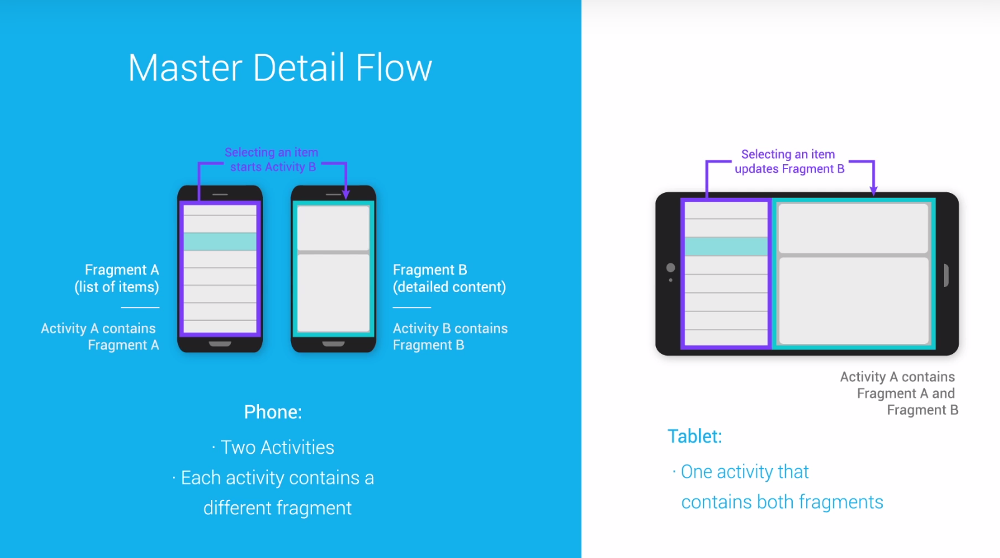
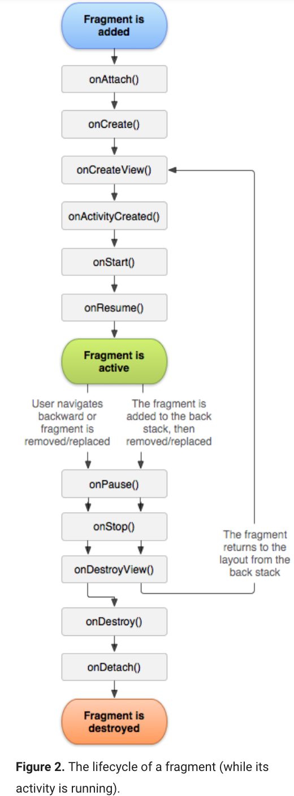
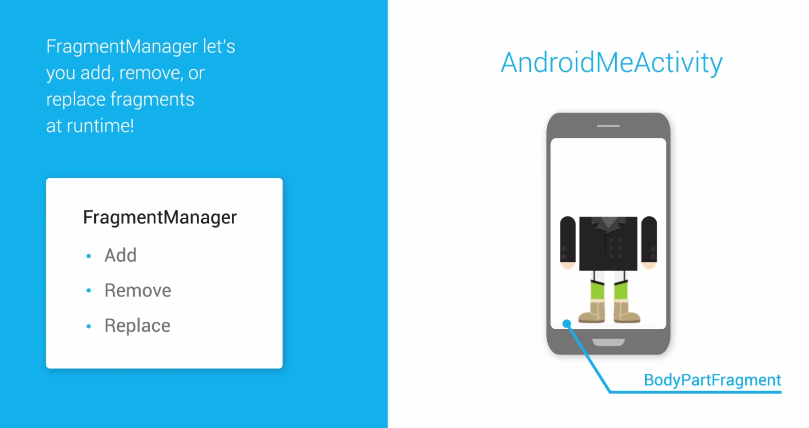
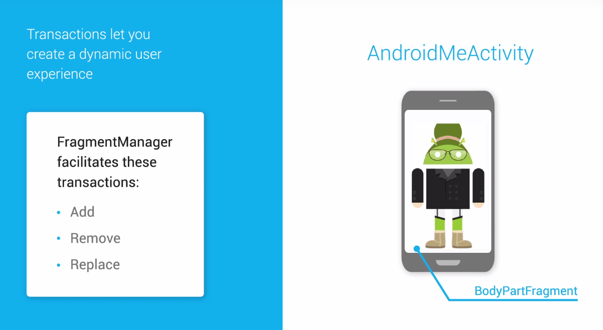
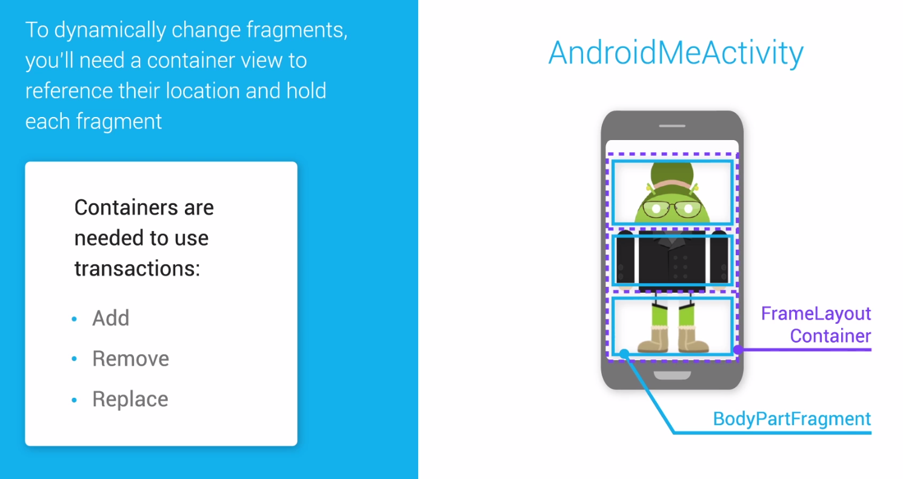
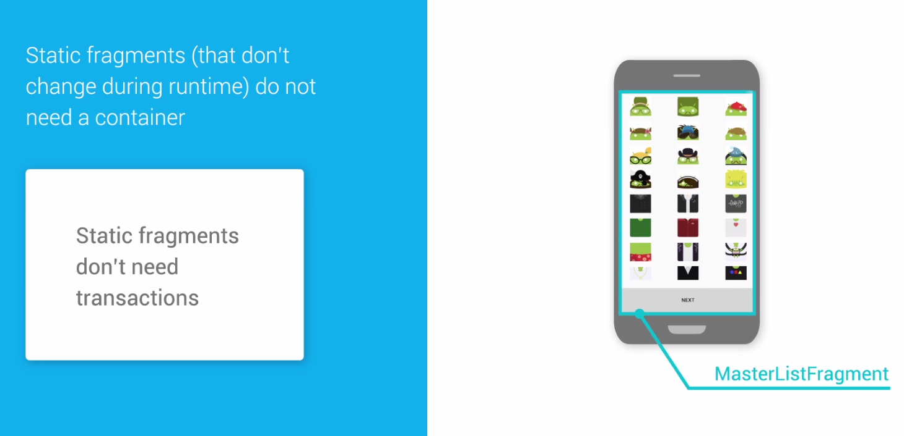
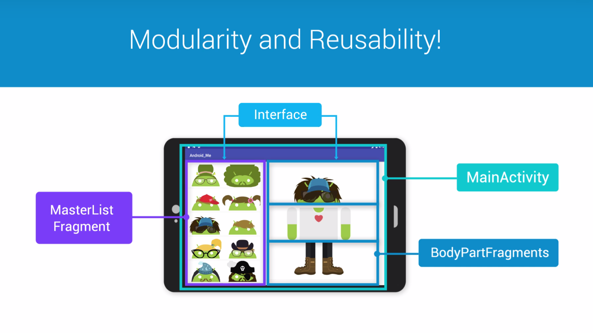

# Lesson 2 - Fragment

## Responsive Layout

Read more about [Implementing Descendent Navigation](https://developer.android.com/training/implementing-navigation/descendant).

## Why Use Fragment ?

It's important to note that a **Fragment** must always be embedded in an activity and the fragment's lifecycle is directly affected by the host activity's lifecycle. For example, when the activity is paused, so are all fragments in it, and when the activity is destroyed, so are all fragments.

Fragments allow to fully modularize the activities.

You can combine multiple fragments in a single activity to build a multi-pane UI, like on a tablet.
And you can reuse a single fragment in multiples activities.



## Fragment Lifecycle

We can think of fragments as mini activities, as portions of UI each with their **own lifecycle**.    
But they also have to be **embedded** within an activity.

Its **lifecycle is directly affected by the host activity lifecycle**.    
So as the host activity moves through its callbacks, onStart - onResume - onPause and onStop, so do anu fragments it contains.

Fragments have a**ddictionnal lifecycle callbacks** that allow them to be created or removed in an activity at runtime.    
So rather than buildong a new view in onCreate, as activites do, fragments use a different event for this called **onCreateView**.    
**OnCreateView** is where a fragment inflates its UI, hooks up any data sources it needs, and returns the created view to the host activity.    
And there's a corresponding **onDestroyView** callback that can be called before a host activity is destroyed.



## Create a fragment

### Fragment Naming Convention

The class name should be in CamelCase. Ex: `SignInFragment`

The corresponding XML file should follow this naming convention `fragment_<FRAGMENT_NAME>.xml`

Ex: `fragment_sign_in.xml`

For a full list of Android naming conventions, checkout [ribot's Android Guidelines](https://github.com/ribot/android-guidelines/blob/master/project_and_code_guidelines.md).

### Choosing Fragment Support Library

Our Fragment class use the v4 [Support Library](https://github.com/ribot/android-guidelines/blob/master/project_and_code_guidelines.md). The v4 libraries are designed to be used with Android 2.3 (API level 9) and higher. They include the largest set of APIs compared to the other libraries, including support for application components, user interface features, accessibility, data handling, network connectivity, and programming utilities.

## Create a Fragment

In the **layout folder**, create a new layout `fragment_body_part.xml` with **ImageView** as root element:
```xml
<?xml version="1.0" encoding="utf-8"?>
<ImageView
    xmlns:android="http://schemas.android.com/apk/res/android"
    android:id="@+id/body_part_image_view"
    android:layout_width="match_parent"
    android:layout_height="match_parent">

</ImageView>
```

Create a new class `BodyPartfragment` in the **UI folder**:
```java
public class BodyPartFragment extends Fragment {

    /**
     * Mandatory empty constructor for the fragment manager to instantiate the fragment
     */
    public BodyPartFragment() {
    }

    /**
     * Inflates the fragment layout file and sets the correct resource for the image to display
     */
    @Override
    public View onCreateView(LayoutInflater inflater, ViewGroup container, Bundle savedInstanceState) {

        // Inflate the Android-Me fragment layout
        View rootView = inflater.inflate(R.layout.fragment_body_part, container, false);

        // Get a reference to the ImageView in the fragment layout
        ImageView imageView = (ImageView) rootView.findViewById(R.id.body_part_image_view);

        // Set the image to the first in our list of head images
        imageView.setImageResource(AndroidImageAssets.getHeads().get(0));

        // Return the rootView
        return rootView;
    }

}
```

In `activity_android_me.xml`:
```xml
<!-- This container holds the head BodyPartFragment of the custom Android-Me image -->
        <FrameLayout android:id="@+id/head_container"
        android:layout_width="match_parent"
        android:layout_height="180dp"
android:scaleType="centerInside"/>
```

In **AndroidMeActivity**:
```java
@Override
    protected void onCreate(Bundle savedInstanceState) {
        super.onCreate(savedInstanceState);
        setContentView(R.layout.activity_android_me);

        // Create a new head BodyPartFragment
        BodyPartFragment headFragment = new BodyPartFragment();

        // Add the fragment to its container using a FragmentManager and a Transaction
        FragmentManager fragmentManager = getSupportFragmentManager();

        fragmentManager.beginTransaction()
                .add(R.id.head_container, headFragment)
                .commit();
}
```

## FragmentManager and Transactions









## More Fragments and Storing Variables

In **AndroidMeActivity**, create 2 new fragments for the body part and the legs part:
```java
// Create and display the body and leg BodyPartFragments

BodyPartFragment bodyFragment = new BodyPartFragment();
bodyFragment.setImageIds(AndroidImageAssets.getBodies());
fragmentManager.beginTransaction()
        .add(R.id.body_container, bodyFragment)
        .commit();

BodyPartFragment legFragment = new BodyPartFragment();
legFragment.setImageIds(AndroidImageAssets.getLegs());
fragmentManager.beginTransaction()
        .add(R.id.leg_container, legFragment)
        .commit();
```

In **BodyPartFragment**:
```java
// Tag for logging
private static final String TAG = "BodyPartFragment";

// Variables to store a list of image resources and the index of the image that this fragment displays
private List<Integer> mImageIds;
private int mListIndex;

@Override
public View onCreateView(LayoutInflater inflater, ViewGroup container, Bundle savedInstanceState) {

    // Inflate the Android-Me fragment layout
    View rootView = inflater.inflate(R.layout.fragment_body_part, container, false);

    // Get a reference to the ImageView in the fragment layout
    ImageView imageView = (ImageView) rootView.findViewById(R.id.body_part_image_view);

    // If a list of image ids exists, set the image resource to the correct item in that list
    // Otherwise, create a Log statement that indicates that the list was not found
    if(mImageIds != null){
        // Set the image resource to the list item at the stored index
        imageView.setImageResource(mImageIds.get(mListIndex));
    } else {
        Log.v(TAG, "This fragment has a null list of image id's");
    }

    // Return the rootView
    return rootView;
}

// Setter methods for keeping track of the list images this fragment can display and which image
// in the list is currently being displayed

public void setImageIds(List<Integer> imageIds) {
    mImageIds = imageIds;
}

public void setListIndex(int index) {
    mListIndex = index;
}
```

In **AndroidMeActivity**, use the setter create in **BodyPartFragment**:
```java
protected void onCreate(Bundle savedInstanceState) {
    ...
// Create a new head BodyPartFragment
BodyPartFragment headFragment = new BodyPartFragment();
// Set the list of image id's for the head fragment and set the position to the second image in the list
headFragment.setImageIds(AndroidImageAssets.getHeads());
headFragment.setListIndex(1);
...
}
```

In activity_android_me.xml:
```xml
<!-- The remaining containers for the body and leg BodyPartFragments -->
<FrameLayout android:id="@+id/body_container"
    android:layout_width="match_parent"
    android:layout_height="180dp"
    android:scaleType="centerInside"/>

<FrameLayout android:id="@+id/leg_container"
    android:layout_width="match_parent"
    android:layout_height="180dp"
android:scaleType="centerInside"/>
```

## Responding to Clicks

In BodyPartFragment:
```java
@Override
public View onCreateView(LayoutInflater inflater, ViewGroup container, Bundle savedInstanceState) {

    // Load the saved state (the list of images and list index) if there is one
    if(savedInstanceState != null) {
        mImageIds = savedInstanceState.getIntegerArrayList(IMAGE_ID_LIST);
        mListIndex = savedInstanceState.getInt(LIST_INDEX);
    }

    // Inflate the Android-Me fragment layout
    View rootView = inflater.inflate(R.layout.fragment_body_part, container, false);

    // Get a reference to the ImageView in the fragment layout
    final ImageView imageView = (ImageView) rootView.findViewById(R.id.body_part_image_view);

    // If a list of image ids exists, set the image resource to the correct item in that list
    // Otherwise, create a Log statement that indicates that the list was not found
    if(mImageIds != null){
        // Set the image resource to the list item at the stored index
        imageView.setImageResource(mImageIds.get(mListIndex));

        // Set a click listener on the image view
        imageView.setOnClickListener(new View.OnClickListener() {
            @Override
            public void onClick(View view) {
                // Increment position as long as the index remains <= the size of the image ids list
                if(mListIndex < mImageIds.size()-1) {
                    mListIndex++;
                } else {
                    // The end of list has been reached, so return to beginning index
                    mListIndex = 0;
                }
                // Set the image resource to the new list item
                imageView.setImageResource(mImageIds.get(mListIndex));
            }
        });

    } else {
        Log.v(TAG, "This fragment has a null list of image id's");
    }

    // Return the rootView
    return rootView;
}
```
Save the state (in BodyPartFragment:
```java
// Final Strings to store state information about the list of images and list index
public static final String IMAGE_ID_LIST = "image_ids";
public static final String LIST_INDEX = "list_index";
/**
* Save the current state of this fragment
*/
@Override
public void onSaveInstanceState(Bundle currentState) {
currentState.putIntegerArrayList(IMAGE_ID_LIST, (ArrayList<Integer>) mImageIds);
currentState.putInt(LIST_INDEX, mListIndex);
}
```
In AndroidMeActivity:
```java
// Only create new fragments when there is no previously saved state
if(savedInstanceState == null) {

    // Create a new head BodyPartFragment
    BodyPartFragment headFragment = new BodyPartFragment();
...
}
```

## Master List Fragment

The master list fragment will not change during the activity's runtime, it's considered a static fragment.   
We can place it in a layout using the fragment tag instead of a transaction.       
In a new layout, activity_main.xml: 
```xml
<?xml version="1.0" encoding="utf-8"?>
<!-- Display the static master list fragment -->
<fragment
    xmlns:android="http://schemas.android.com/apk/res/android"
    android:id="@+id/master_list_fragment"
    android:name="com.example.android.android_me.ui.MasterListFragment"
    android:layout_width="match_parent"
android:layout_height="match_parent" />
```

Create a new MainActivity:
```java
// This activity is responsible for displaying the master list of all images
public class MainActivity extends AppCompatActivity {


    @Override
    protected void onCreate(Bundle savedInstanceState) {
        super.onCreate(savedInstanceState);
        setContentView(R.layout.activity_main);

    }

}
```

Declare this activity in the AndroidManifest.xml
```xml
<!-- Declare the MainActivity in the manifest and set it to launch upon opening this app -->
<activity android:name=".ui.MainActivity" >
    <intent-filter>
        <action android:name="android.intent.action.MAIN" />

        <category android:name="android.intent.category.LAUNCHER" />
    </intent-filter>
</activity>
```
Create a new layout, fragment_master_list.xml:
```xml
<?xml version="1.0" encoding="utf-8"?>
<!-- GridView that displays AndroidMe images -->
<GridView
    xmlns:android="http://schemas.android.com/apk/res/android"
    android:id="@+id/images_grid_view"
    android:layout_width="match_parent"
    android:layout_height="wrap_content"
    android:adjustViewBounds="true"
    android:columnWidth="180dp"
    android:gravity="center"
    android:horizontalSpacing="8dp"
    android:numColumns="3"
    android:padding="16dp"
    android:stretchMode="columnWidth"
    android:verticalSpacing="8dp">
</GridView>
```
Create a new MasterListFragment:
```java
// This fragment displays all of the AndroidMe images in one large list
// The list appears as a grid of images
public class MasterListFragment extends Fragment {

    // Mandatory empty constructor
    public MasterListFragment() {
    }

    // Inflates the GridView of all AndroidMe images
    @Override
    public View onCreateView(LayoutInflater inflater, ViewGroup container,
                             Bundle savedInstanceState) {

        final View rootView = inflater.inflate(R.layout.fragment_master_list, container, false);

        // Get a reference to the GridView in the fragment_master_list xml layout file
        GridView gridView = (GridView) rootView.findViewById(R.id.images_grid_view);

        // Create the adapter
        // This adapter takes in the context and an ArrayList of ALL the image resources to display
        MasterListAdapter mAdapter = new MasterListAdapter(getContext(), AndroidImageAssets.getAll());

        // Set the adapter on the GridView
        gridView.setAdapter(mAdapter);

        // Return the root view
        return rootView;
    }

}
```

## Communicating Between Fragments



## Define a Interface

Define an interface in the fragment class, MasterListFragment:
```java
// Define a new interface OnImageClickListener that triggers a callback in the host activity
OnImageClickListener mCallback;

// OnImageClickListener interface, calls a method in the host activity named onImageSelected
public interface OnImageClickListener {
    void onImageSelected(int position);
}
// Override onAttach to make sure that the container activity has implemented the callback
@Override
public void onAttach(Context context) {
    super.onAttach(context);

    // This makes sure that the host activity has implemented the callback interface
    // If not, it throws an exception
    try {
        mCallback = (OnImageClickListener) context;
    } catch (ClassCastException e) {
        throw new ClassCastException(context.toString()
                + " must implement OnImageClickListener");
    }
}

// Inflates the GridView of all AndroidMe images
@Override
public View onCreateView(LayoutInflater inflater, ViewGroup container,
                            Bundle savedInstanceState) {

    ...

    // Set a click listener on the gridView and trigger the callback onImageSelected when an item is clicked
    gridView.setOnItemClickListener(new AdapterView.OnItemClickListener() {
        @Override
        public void onItemClick(AdapterView<?> adapterView, View view, int position, long l) {
            // Trigger the callback method and pass in the position that was clicked
            mCallback.onImageSelected(position);
        }
    });

    // Return the root view
    return rootView;
}
```
In MainActivity:
```java

// This activity is responsible for displaying the master list of all images
// Implement the MasterListFragment callback, OnImageClickListener
public class MainActivity extends AppCompatActivity implements MasterListFragment.OnImageClickListener{
    ...
    // Define the behavior for onImageSelected
    public void onImageSelected(int position) {
        // Create a Toast that displays the position that was clicked
        Toast.makeText(this, "Position clicked = " + position, Toast.LENGTH_SHORT).show();
    }
}
```
## Communicate Between Activities

In MainActivity:
```java
// Variables to store the values for the list index of the selected images
// The default value will be index = 0
private int headIndex;
private int bodyIndex;
private int legIndex;

// Define the behavior for onImageSelected
public void onImageSelected(int position) {
    // Create a Toast that displays the position that was clicked
    Toast.makeText(this, "Position clicked = " + position, Toast.LENGTH_SHORT).show();

    // Based on where a user has clicked, store the selected list index for the head, body, and leg BodyPartFragments

    // bodyPartNumber will be = 0 for the head fragment, 1 for the body, and 2 for the leg fragment
    // Dividing by 12 gives us these integer values because each list of images resources has a size of 12
    int bodyPartNumber = position /12;

    // Store the correct list index no matter where in the image list has been clicked
    // This ensures that the index will always be a value between 0-11
    int listIndex = position - 12*bodyPartNumber;

    // Set the currently displayed item for the correct body part fragment
    switch(bodyPartNumber) {
        case 0: headIndex = listIndex;
            break;
        case 1: bodyIndex = listIndex;
            break;
        case 2: legIndex = listIndex;
            break;
        default: break;
    }

    // Put this information in a Bundle and attach it to an Intent that will launch an AndroidMeActivity
    Bundle b = new Bundle();
    b.putInt("headIndex", headIndex);
    b.putInt("bodyIndex", bodyIndex);
    b.putInt("legIndex", legIndex);

    // Attach the Bundle to an intent
    final Intent intent = new Intent(this, AndroidMeActivity.class);
    intent.putExtras(b);

    // The "Next" button launches a new AndroidMeActivity
    Button nextButton = (Button) findViewById(R.id.next_button);
    nextButton.setOnClickListener(new View.OnClickListener() {
        @Override
        public void onClick(View view) {
            startActivity(intent);
        }
    });

}
```
In fragment_master_list.xml:
```xml
<!-- GridView that displays AndroidMe images -->
<LinearLayout
    xmlns:android="http://schemas.android.com/apk/res/android"
    android:layout_width="match_parent"
    android:layout_height="match_parent"
    android:orientation="vertical">

<GridView
       ...>
</GridView>

<!-- The "Next" button -->
<Button
    android:id="@+id/next_button"
    android:layout_width="match_parent"
    android:layout_height="0dp"
    android:layout_gravity="center_horizontal"
    android:layout_weight="1"
    android:text="Next" />
```

In AndroidMeActivity:
```java
@Override
protected void onCreate(Bundle savedInstanceState) {
    super.onCreate(savedInstanceState);
    setContentView(R.layout.activity_android_me);

    // Only create new fragments when there is no previously saved state
    if(savedInstanceState == null) {

        // Retrieve list index values that were sent through an intent; use them to display the desired Android-Me body part image
            // Use setListindex(int index) to set the list index for all BodyPartFragments

        // Create a new head BodyPartFragment
        BodyPartFragment headFragment = new BodyPartFragment();

        // Set the list of image id's for the head fragment and set the position to the second image in the list
        headFragment.setImageIds(AndroidImageAssets.getHeads());

        // Get the correct index to access in the array of head images from the intent
        // Set the default value to 0
        int headIndex = getIntent().getIntExtra("headIndex", 0);
        headFragment.setListIndex(headIndex);

        // Add the fragment to its container using a FragmentManager and a Transaction
        FragmentManager fragmentManager = getSupportFragmentManager();

        fragmentManager.beginTransaction()
                .add(R.id.head_container, headFragment)
                .commit();

        // Create and display the body and leg BodyPartFragments

        BodyPartFragment bodyFragment = new BodyPartFragment();
        bodyFragment.setImageIds(AndroidImageAssets.getBodies());
        int bodyIndex = getIntent().getIntExtra("bodyIndex", 0);
        bodyFragment.setListIndex(bodyIndex);

        fragmentManager.beginTransaction()
                .add(R.id.body_container, bodyFragment)
                .commit();

        BodyPartFragment legFragment = new BodyPartFragment();
        legFragment.setImageIds(AndroidImageAssets.getLegs());
        int legIndex = getIntent().getIntExtra("legIndex", 0);
        legFragment.setListIndex(legIndex);

        fragmentManager.beginTransaction()
                .add(R.id.leg_container, legFragment)
                .commit();
    }

}
```

## Two Pane Layout

### Responsive Design

If you decide to implement a divider in the UI, checkout this [suggestion](https://stackoverflow.com/questions/5049852/android-drawing-separator-divider-line-in-layout/14533085#14533085).

In a new folder, create a new two-pane activity_main.xml layout for tablets (sw600dp) that will override the default layout resource.

Build the layout to display the MasterListFragment and all BodyPartFragments side-by-side.
```xml
<LinearLayout xmlns:android="http://schemas.android.com/apk/res/android"
    xmlns:tools="http://schemas.android.com/tools"
    android:layout_width="match_parent"
    android:layout_height="match_parent"
    android:baselineAligned="false"
    android:orientation="horizontal"
    tools:context="com.example.android.android_me.ui.MainActivity">

    <!--
    This layout is a two-pane layout for the master/detail flow.
    -->

    <!-- The static MasterListFragment -->
    <fragment
        android:id="@+id/master_list_fragment"
        android:name="com.example.android.android_me.ui.MasterListFragment"
        android:layout_width="400dp"
        android:layout_height="match_parent" />

    <!-- A small divider -->
    <View
        android:layout_width="1dp"
        android:layout_height="match_parent"
        android:background="@android:color/darker_gray" />

    <!-- LinearLayout that arranges all three Android-Me body part images vertically -->
    <LinearLayout
        android:id="@+id/android_me_linear_layout"
        android:layout_width="wrap_content"
        android:layout_height="wrap_content"
        android:layout_gravity="center_vertical"
        android:background="@android:color/white"
        android:orientation="vertical"
        android:paddingBottom="@dimen/activity_vertical_margin"
        android:paddingLeft="@dimen/activity_horizontal_margin"
        android:paddingRight="@dimen/activity_horizontal_margin"
        android:paddingTop="@dimen/activity_vertical_margin">

        <!-- Three vertically arranged body part fragments - the frame layouts are containers -
        one for each Android-Me part (head, body, legs) -->
        <FrameLayout
            android:id="@+id/head_container"
            android:layout_width="match_parent"
            android:layout_height="180dp"
            android:scaleType="centerInside"/>

        <FrameLayout
            android:id="@+id/body_container"
            android:layout_width="match_parent"
            android:layout_height="180dp"
            android:scaleType="centerInside"/>

        <FrameLayout
            android:id="@+id/leg_container"
            android:layout_width="match_parent"
            android:layout_height="180dp"
            android:scaleType="centerInside"/>
    </LinearLayout>
</LinearLayout>
```

In MainActivity, create a variable to track wether to display a two-pane or a single-pane UI.

If you are making a two-pane display, add new BodyPartFragments to create an initial Android-Me image.

In the onImageSelected callback, handle the two-pane and replace existing fragments right when a new image is selected from the master list.
```java
// Track whether to display a two-pane or single-pane UI
// A single-pane display refers to phone screens, and two-pane to larger tablet screens
private boolean mTwoPane;
@Override
protected void onCreate(Bundle savedInstanceState) {
    super.onCreate(savedInstanceState);
    setContentView(R.layout.activity_main);

    // Determine if you're creating a two-pane or single-pane display
    if(findViewById(R.id.android_me_linear_layout) != null) {
        // This LinearLayout will only initially exist in the two-pane tablet case
        mTwoPane = true;
        // Change the GridView to space out the images more on tablet
        GridView gridView = (GridView) findViewById(R.id.images_grid_view);
        gridView.setNumColumns(2);

        // Getting rid of the "Next" button that appears on phones for launching a separate activity
        Button nextButton = (Button) findViewById(R.id.next_button);
        nextButton.setVisibility(View.GONE);

        if(savedInstanceState == null) {
            // In two-pane mode, add initial BodyPartFragments to the screen
            FragmentManager fragmentManager = getSupportFragmentManager();

            // Creating a new head fragment
            BodyPartFragment headFragment = new BodyPartFragment();
            headFragment.setImageIds(AndroidImageAssets.getHeads());
            // Add the fragment to its container using a transaction
            fragmentManager.beginTransaction()
                    .add(R.id.head_container, headFragment)
                    .commit();

            // New body fragment
            BodyPartFragment bodyFragment = new BodyPartFragment();
            bodyFragment.setImageIds(AndroidImageAssets.getBodies());
            fragmentManager.beginTransaction()
                    .add(R.id.body_container, bodyFragment)
                    .commit();

            // New leg fragment
            BodyPartFragment legFragment = new BodyPartFragment();
            legFragment.setImageIds(AndroidImageAssets.getLegs());
            fragmentManager.beginTransaction()
                .add(R.id.leg_container, legFragment)
                .commit();
    } else {
        // We're in single-pane mode and displaying fragments on a phone in separate activities
        mTwoPane = false;
    }
}

// Define the behavior for onImageSelected
public void onImageSelected(int position) {
    // Create a Toast that displays the position that was clicked
    Toast.makeText(this, "Position clicked = " + position, Toast.LENGTH_SHORT).show();

    // bodyPartNumber will be = 0 for the head fragment, 1 for the body, and 2 for the leg fragment
    // Dividing by 12 gives us these integer values because each list of images resources has a size of 12
    int bodyPartNumber = position /12;

    // Store the correct list index no matter where in the image list has been clicked
    // This ensures that the index will always be a value between 0-11
    int listIndex = position - 12*bodyPartNumber;

    // Handle the two-pane case and replace existing fragments right when a new image is selected from the master list
    if (mTwoPane) {
        // Create two=pane interaction

        BodyPartFragment newFragment = new BodyPartFragment();

        // Set the currently displayed item for the correct body part fragment
        switch (bodyPartNumber) {
            case 0:
                // A head image has been clicked
                // Give the correct image resources to the new fragment
                newFragment.setImageIds(AndroidImageAssets.getHeads());
                newFragment.setListIndex(listIndex);
                // Replace the old head fragment with a new one
                getSupportFragmentManager().beginTransaction()
                        .replace(R.id.head_container, newFragment)
                        .commit();
                break;
            case 1:
                newFragment.setImageIds(AndroidImageAssets.getBodies());
                newFragment.setListIndex(listIndex);
                getSupportFragmentManager().beginTransaction()
                        .replace(R.id.body_container, newFragment)
                        .commit();
                break;
            case 2:
                newFragment.setImageIds(AndroidImageAssets.getLegs());
                newFragment.setListIndex(listIndex);
                getSupportFragmentManager().beginTransaction()
                        .replace(R.id.leg_container, newFragment)
                        .commit();
                break;
            default:
                break;
        }
    } else {

        // Handle the single-pane phone case by passing information in a Bundle attached to an Intent

        switch (bodyPartNumber) {
            case 0:
                headIndex = listIndex;
                break;
            case 1:
                bodyIndex = listIndex;
                break;
            case 2:
                legIndex = listIndex;
                break;
            default:
                break;
        }

        // Put this information in a Bundle and attach it to an Intent that will launch an AndroidMeActivity
        Bundle b = new Bundle();
        b.putInt("headIndex", headIndex);
        b.putInt("bodyIndex", bodyIndex);
        b.putInt("legIndex", legIndex);

        // Attach the Bundle to an intent
        final Intent intent = new Intent(this, AndroidMeActivity.class);
        intent.putExtras(b);

        // The "Next" button launches a new AndroidMeActivity
        Button nextButton = (Button) findViewById(R.id.next_button);
        nextButton.setOnClickListener(new View.OnClickListener() {
            @Override
            public void onClick(View view) {
                startActivity(intent);
            }
        });
    }

}
```


