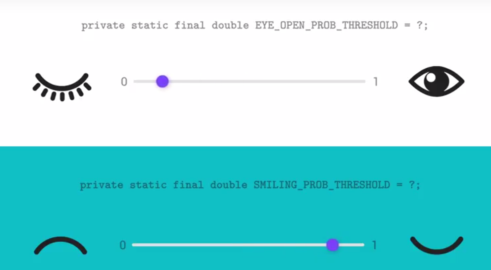

# Lesson 3 - Librairies

https://github.com/udacity/AdvancedAndroid_Emojify

## When to use Librairies

Creating a content provider is no easy feat, and it has many components. Many developers have struggled with this, so naturally, someone created a library to simplify this process. Check out [Schematic](https://github.com/SimonVT/schematic) for an example of such a library.

Loading images over the network is a challenge since it depends heavily on network availability and consumes a lot of battery. There are many libraries that help with this, including robust features such as caching, configured timeouts and more. See [Picasso](http://square.github.io/picasso/) for an example of such a library.

Barcode scanning is a feature that is available in many different applications, so that should give you a hint that there are libraries that help with that. The Google Mobile Vision library includes API's for scanning barcodes.

Complex logging needs can also be addressed using Libraries. The default logger falls short if you need to modify what kind of things you need displayed in the debugger depending on what version of your app is Running. [Timber](https://github.com/JakeWharton/timber) includes this, and many more features.

## Finding Librairies

Finding a library that fits your needs starts where all the rest of your questions have been answered so far: that's right, [stackoverflow](https://stackoverflow.com/).

Libraries are useful for solving problems that appear over and over again in different applications. If you search Stack Overflow, often the accepted solution to the problem you are trying to solve will be a third party library that does exactly what you're looking for.

I'd also like to mention two more resources for finding libraries: The first one is [Android Arsenal](https://android-arsenal.com/), which is a large library of libraries (aha) that just about anyone can add to. There are literally thousands of libraries on here, of highly varied quality. The second resource is this [Github](https://github.com/codepath/android_guides/wiki/Must-Have-libraries) page, which lists some of the most commonly used android libraries.

### But Wait!

A word of caution: just because there is a library that seems like a perfect fit for you need, do not be too hasty in adding it to you application. Using a library that is not well maintained or documented comes with a host of other issues and is likely to cause more of a headache than it cures. The next video will be devoted to figuring out whether a library is a good candidate for your application.
64K Method Limit

Another consideration in deciding whether or not to use a library is to be aware of how it will affect the size of your app. When your app, including the libraries it uses, reaches a certain size, you encounter build errors that indicate your app has reached a limit of the Android app build architecture ([64K Method Limit](https://developer.android.com/studio/build/multidex)). Libraries are commonly used and without a doubt efficient, but do be aware of theses considerations. 

## Choose a Librairy

For more information on licenses and which licenses to use, check out this [link](https://choosealicense.com/)

Watch out for:
- maintenance
- issues
- features
- license

## Explore Starter Code

[Runtime permissions information](https://github.com/udacity/AdvancedAndroid_Emojify)

## Explore the Starter Code : Bitmap Utils

`resamplePic()`: The `resamplePic()` method gets the height and width of the device screen in pixels, and resamples the passed in image to fit the screen.

`createTempImageFile()`: This method creates a temporary file in the external cache directory and returns the new temp file.

`deleteImageFile()`: This method attempts to delete the image at the passed in path. If it fails, it shows a toast.

`galleryAddPic()`: This method cause the image content provider to add the image from the passed in path to the system gallery, so it can be found by other app. It is only called inside the `saveImage()` described below.

`saveImage()`: This method saves the passed in Bitmap in the External Storage, in the subdirectory called "Emojify". It also adds the image to the system gallery by calling the above `galleryAddPic()`.

`shareImage()`: This method creates a share implicit intent, which will bring up the system chooser with apps that handle sharing an image.

## Add Gradle Dependency

[Set Up Google Play Services documentation](https://developers.google.com/android/guides/setup)

- Tools > Android > SDK Manager
- Choose SDK Tools Tabs
- Scroll down to Support Repository section
- Check the Google Repository
- Click OK

In build.gradle(app), add:
```compile 'com.google.android.gms:play-services-vision:10.2.0'```

## Detect Faces 

Create a new class `Emojifier`.  
Create a static method detectFaces, which takes 2 arguments, the context and the bitmap: `detectFaces(Context, Bitmap)`
```java

class Emojifier {

    private static final String LOG_TAG = Emojifier.class.getSimpleName();

    /**
     * Method for detecting faces in a bitmap.
     *
     * @param context The application context.
     * @param picture The picture in which to detect the faces.
     */
    static void detectFaces(Context context, Bitmap picture) {

        // Create the face detector, disable tracking and enable classifications
        FaceDetector detector = new FaceDetector.Builder(context)
                .setTrackingEnabled(false)
                .setClassificationType(FaceDetector.ALL_CLASSIFICATIONS)
                .build();

        // Build the frame
        Frame frame = new Frame.Builder().setBitmap(picture).build();

        // Detect the faces
        SparseArray<Face> faces = detector.detect(frame);

        // Log the number of faces
        Log.d(LOG_TAG, "detectFaces: number of faces = " + faces.size());

        // If there are no faces detected, show a Toast message
        if(faces.size() == 0){
            Toast.makeText(context, R.string.no_faces_message, Toast.LENGTH_SHORT).show();
        }

        // Release the detector
        detector.release();
    }
}

```
This method should detect the number of faces in the image and log the result, or a Toast message otherwise. 
  
Call detectFaces from `processAndSetImage()` in MainActivity.
```java
/**
* Method for processing the captured image and setting it to the TextView.
*/
private void processAndSetImage() {

// Toggle Visibility of the views
...

// Resample the saved image to fit the ImageView
mResultsBitmap = BitmapUtils.resamplePic(this, mTempPhotoPath);

// Detect the faces
Emojifier.detectFaces(this, mResultsBitmap);

// Set the new bitmap to the ImageView
mImageView.setImageBitmap(mResultsBitmap);
}
```

Create a static method `getClassifications()` which logs the probability of each eye being open and that the person is smiling (in Emojifier class).
```java
/**
* Method for logging the classification probabilities.
*
* @param face The face to get the classification probabilities.
*/
private static void getClassifications(Face face){
// Log all the probabilities
Log.d(LOG_TAG, "getClassifications: smilingProb = " + face.getIsSmilingProbability());
Log.d(LOG_TAG, "getClassifications: leftEyeOpenProb = "
        + face.getIsLeftEyeOpenProbability());
Log.d(LOG_TAG, "getClassifications: rightEyeOpenProb = "
        + face.getIsRightEyeOpenProbability());
}
```

Then in `detectFaces()`, iterate through the faces calling getClassifications for each one.
```java
/**
* Method for detecting faces in a bitmap.
*
* @param context The application context.
* @param picture The picture in which to detect the faces.
*/
static void detectFaces(Context context, Bitmap picture) {

// Create the face detector, disable tracking and enable classifications
FaceDetector detector = new FaceDetector.Builder(context)
        .setTrackingEnabled(false)
        .setClassificationType(FaceDetector.ALL_CLASSIFICATIONS)
        .build();

// Build the frame
Frame frame = new Frame.Builder().setBitmap(picture).build();

// Detect the faces
SparseArray<Face> faces = detector.detect(frame);

// Log the number of faces
Log.d(LOG_TAG, "detectFaces: number of faces = " + faces.size());

// If there are no faces detected, show a Toast message
if(faces.size() == 0){
    Toast.makeText(context, R.string.no_faces_message, Toast.LENGTH_SHORT).show();
} else {
    for (int i = 0; i < faces.size(); ++i) {
        Face face = faces.valueAt(i);

        // Log the classification probabilities for each face.
        getClassifications(face);
    }

}


// Release the detector
detector.release();
}
```

## Map to Emojis


In Emojifier class:

Create an enum class `Emoji` that contans all the possible emoji you can make.
```java
// Enum for all possible Emojis
private enum Emoji {
    SMILE,
    FROWN,
    LEFT_WINK,
    RIGHT_WINK,
    LEFT_WINK_FROWN,
    RIGHT_WINK_FROWN,
    CLOSED_EYE_SMILE,
    CLOSED_EYE_FROWN
}
```
Create threshold constants for a person smiling, and eye being open.
```java
private static final double SMILING_PROB_THRESHOLD = .15;
private static final double EYE_OPEN_PROB_THRESHOLD = .5;
```
Create 3 boolean variables to track the state of facial expression.

Create an if/else system that selects the appropriate emoji.    
Change the name of `getClassifications()` to `whichEmoji()`.
```java
private static void whichEmoji(Face face) {

    // Log all the probabilities
    Log.d(LOG_TAG, "whichEmoji: smilingProb = " + face.getIsSmilingProbability());
    Log.d(LOG_TAG, "whichEmoji: leftEyeOpenProb = "
            + face.getIsLeftEyeOpenProbability());
    Log.d(LOG_TAG, "whichEmoji: rightEyeOpenProb = "
            + face.getIsRightEyeOpenProbability());


    boolean smiling = face.getIsSmilingProbability() > SMILING_PROB_THRESHOLD;

    boolean leftEyeClosed = face.getIsLeftEyeOpenProbability() < EYE_OPEN_PROB_THRESHOLD;
    boolean rightEyeClosed = face.getIsRightEyeOpenProbability() < EYE_OPEN_PROB_THRESHOLD;


    // Determine and log the appropriate emoji
    Emoji emoji;
    if(smiling) {
        if (leftEyeClosed && !rightEyeClosed) {
            emoji = Emoji.LEFT_WINK;
        }  else if(rightEyeClosed && !leftEyeClosed){
            emoji = Emoji.RIGHT_WINK;
        } else if (leftEyeClosed){
            emoji = Emoji.CLOSED_EYE_SMILE;
        } else {
            emoji = Emoji.SMILE;
        }
    } else {
        if (leftEyeClosed && !rightEyeClosed) {
            emoji = Emoji.LEFT_WINK_FROWN;
        }  else if(rightEyeClosed && !leftEyeClosed){
            emoji = Emoji.RIGHT_WINK_FROWN;
        } else if (leftEyeClosed){
            emoji = Emoji.CLOSED_EYE_FROWN;
        } else {
            emoji = Emoji.FROWN;
        }
    }


    // Log the chosen Emoji
    Log.d(LOG_TAG, "whichEmoji: " + emoji.name());
}
```

## Set Probability Thresholds




## Overlay Emoji

The `whichEmoji()` method already determines the proper Emoji based on the facial expression.

You should now use it in a switch statement to select the proper emoji drawable. Do the following:

- Change the return type of the `whichEmoji()` method to the Emoji enum.

- At the end of the method, return the proper Emoji.

- Rename the `detectFaces()` method to `detectFacesAndOverlayEmoji()` since this method will now overlay the proper drawable as well as detect the faces, and change it's return type from `void` to `Bitmap`. Initialize an empty drawable inside the loop which iterates through the detected faces called `emojiBitmap`, used to hold the correct emoji drawable. Create a switch statement using the result of the `whichEmoji()` method as the argument, with a case for each Emoji, and use the `BitmapFactory.decodeResource()` method to define the initialized drawable to be the appropriate Emoji based on the result of the switch.

You should now have the following components: The original picture bitmap from the camera, passed into the `detectFacesAndOverlayEmoji()` method. The appropriate Emoji bitmap for each face, defined inside the faces for loop. The detected face, again defined inside the loop.


The next step involves creating a new method, `addBitmapToFace()`, which takes the three components we just discussed (picture bitmap, Emoji bitmap, and Face object), and combines them, overlaying the Emoji bitmap over the detected face on each iteration of the loop and returning the resulting, combined bitmap.

Combining Bitmaps is straightforward, but outside of the scope of this lesson. You can copy the code for this method below, and I will step through the functionality in the next node. For a more detailed explanation on working with 2D graphics take a look at the [Developer Docs](https://developer.android.com/guide/topics/graphics/drawables).

```java
class Emojifier {

    private static final String LOG_TAG = Emojifier.class.getSimpleName();

    private static final float EMOJI_SCALE_FACTOR = .9f;
    private static final double SMILING_PROB_THRESHOLD = .15;
    private static final double EYE_OPEN_PROB_THRESHOLD = .5;

    /**
     * Method for detecting faces in a bitmap, and drawing emoji depending on the facial
     * expression.
     *
     * @param context The application context.
     * @param picture The picture in which to detect the faces.
     */
    static Bitmap detectFacesandOverlayEmoji(Context context, Bitmap picture) {

        // Create the face detector, disable tracking and enable classifications
        FaceDetector detector = new FaceDetector.Builder(context)
                .setTrackingEnabled(false)
                .setClassificationType(FaceDetector.ALL_CLASSIFICATIONS)
                .build();

        // Build the frame
        Frame frame = new Frame.Builder().setBitmap(picture).build();

        // Detect the faces
        SparseArray<Face> faces = detector.detect(frame);

        // Log the number of faces
        Log.d(LOG_TAG, "detectFaces: number of faces = " + faces.size());

        // Initialize result bitmap to original picture
        Bitmap resultBitmap = picture;

        // If there are no faces detected, show a Toast message
        if (faces.size() == 0) {
            Toast.makeText(context, R.string.no_faces_message, Toast.LENGTH_SHORT).show();
        } else {

            // Iterate through the faces
            for (int i = 0; i < faces.size(); ++i) {
                Face face = faces.valueAt(i);

                Bitmap emojiBitmap;
                switch (whichEmoji(face)) {
                    case SMILE:
                        emojiBitmap = BitmapFactory.decodeResource(context.getResources(),
                                R.drawable.smile);
                        break;
                    case FROWN:
                        emojiBitmap = BitmapFactory.decodeResource(context.getResources(),
                                R.drawable.frown);
                        break;
                    case LEFT_WINK:
                        emojiBitmap = BitmapFactory.decodeResource(context.getResources(),
                                R.drawable.leftwink);
                        break;
                    case RIGHT_WINK:
                        emojiBitmap = BitmapFactory.decodeResource(context.getResources(),
                                R.drawable.rightwink);
                        break;
                    case LEFT_WINK_FROWN:
                        emojiBitmap = BitmapFactory.decodeResource(context.getResources(),
                                R.drawable.leftwinkfrown);
                        break;
                    case RIGHT_WINK_FROWN:
                        emojiBitmap = BitmapFactory.decodeResource(context.getResources(),
                                R.drawable.rightwinkfrown);
                        break;
                    case CLOSED_EYE_SMILE:
                        emojiBitmap = BitmapFactory.decodeResource(context.getResources(),
                                R.drawable.closed_smile);
                        break;
                    case CLOSED_EYE_FROWN:
                        emojiBitmap = BitmapFactory.decodeResource(context.getResources(),
                                R.drawable.closed_frown);
                        break;
                    default:
                        emojiBitmap = null;
                        Toast.makeText(context, R.string.no_emoji, Toast.LENGTH_SHORT).show();
                }

                // Add the emojiBitmap to the proper position in the original image
                resultBitmap = addBitmapToFace(resultBitmap, emojiBitmap, face);
            }
        }


        // Release the detector
        detector.release();

        return resultBitmap;
    }


    /**
     * Determines the closest emoji to the expression on the face, based on the
     * odds that the person is smiling and has each eye open.
     *
     * @param face The face for which you pick an emoji.
     */

    private static Emoji whichEmoji(Face face) {
        // Log all the probabilities
        Log.d(LOG_TAG, "whichEmoji: smilingProb = " + face.getIsSmilingProbability());
        Log.d(LOG_TAG, "whichEmoji: leftEyeOpenProb = "
                + face.getIsLeftEyeOpenProbability());
        Log.d(LOG_TAG, "whichEmoji: rightEyeOpenProb = "
                + face.getIsRightEyeOpenProbability());


        boolean smiling = face.getIsSmilingProbability() > SMILING_PROB_THRESHOLD;

        boolean leftEyeClosed = face.getIsLeftEyeOpenProbability() < EYE_OPEN_PROB_THRESHOLD;
        boolean rightEyeClosed = face.getIsRightEyeOpenProbability() < EYE_OPEN_PROB_THRESHOLD;


        // Determine and log the appropriate emoji
        Emoji emoji;
        if(smiling) {
            if (leftEyeClosed && !rightEyeClosed) {
                emoji = Emoji.LEFT_WINK;
            }  else if(rightEyeClosed && !leftEyeClosed){
                emoji = Emoji.RIGHT_WINK;
            } else if (leftEyeClosed){
                emoji = Emoji.CLOSED_EYE_SMILE;
            } else {
                emoji = Emoji.SMILE;
            }
        } else {
            if (leftEyeClosed && !rightEyeClosed) {
                emoji = Emoji.LEFT_WINK_FROWN;
            }  else if(rightEyeClosed && !leftEyeClosed){
                emoji = Emoji.RIGHT_WINK_FROWN;
            } else if (leftEyeClosed){
                emoji = Emoji.CLOSED_EYE_FROWN;
            } else {
                emoji = Emoji.FROWN;
            }
        }


        // Log the chosen Emoji
        Log.d(LOG_TAG, "whichEmoji: " + emoji.name());

        return emoji;
    }

    /**
     * Combines the original picture with the emoji bitmaps
     *
     * @param backgroundBitmap The original picture
     * @param emojiBitmap      The chosen emoji
     * @param face             The detected face
     * @return The final bitmap, including the emojis over the faces
     */
    private static Bitmap addBitmapToFace(Bitmap backgroundBitmap, Bitmap emojiBitmap, Face face) {

        // Initialize the results bitmap to be a mutable copy of the original image
        Bitmap resultBitmap = Bitmap.createBitmap(backgroundBitmap.getWidth(),
                backgroundBitmap.getHeight(), backgroundBitmap.getConfig());

        // Scale the emoji so it looks better on the face
        float scaleFactor = EMOJI_SCALE_FACTOR;

        // Determine the size of the emoji to match the width of the face and preserve aspect ratio
        int newEmojiWidth = (int) (face.getWidth() * scaleFactor);
        int newEmojiHeight = (int) (emojiBitmap.getHeight() *
                newEmojiWidth / emojiBitmap.getWidth() * scaleFactor);


        // Scale the emoji
        emojiBitmap = Bitmap.createScaledBitmap(emojiBitmap, newEmojiWidth, newEmojiHeight, false);

        // Determine the emoji position so it best lines up with the face
        float emojiPositionX =
                (face.getPosition().x + face.getWidth() / 2) - emojiBitmap.getWidth() / 2;
        float emojiPositionY =
                (face.getPosition().y + face.getHeight() / 2) - emojiBitmap.getHeight() / 3;

        // Create the canvas and draw the bitmaps to it
        Canvas canvas = new Canvas(resultBitmap);
        canvas.drawBitmap(backgroundBitmap, 0, 0, null);
        canvas.drawBitmap(emojiBitmap, emojiPositionX, emojiPositionY, null);

        return resultBitmap;
    }
    

    // Enum for all possible Emojis
    private enum Emoji {
        SMILE,
        FROWN,
        LEFT_WINK,
        RIGHT_WINK,
        LEFT_WINK_FROWN,
        RIGHT_WINK_FROWN,
        CLOSED_EYE_SMILE,
        CLOSED_EYE_FROWN
    }

}

```

## Must Have Librairies

To conclude this lesson, here are some other Libraries that many Android applications use.

- **Picasso and Glide**: A common problem that Android developers face is the proper use of images in their application. Including many high quality images will drastically increase your apk size, while downloading images over the network comes with memory consumption and network availability problems. Picasso and Glide are both very robust libraries that facilitate the loading, caching and displaying of Images. They include tons of amazing features, such as the ability to include placeholder images and local caching, so almost every application that includes images uses one of these libraries. Check out the documentation on [Picasso](http://square.github.io/picasso/) and [Glide](https://github.com/bumptech/glide).

- **Butterknife**: If you've created an app with a lot of views, then you'll know how tedious it can be to write `findViewById()` calls for each one, as well as to create custom onClicks for each one. These tasks pertain to Data Binding, the realm of connecting your data to the user facing views. Butterknife is a revolutionary library that uses annotations to make this much easier. Check out the [documentation](http://jakewharton.github.io/butterknife/) for some examples of how this can make your life much easier. You can even implement it in our Emojifier app if you want; check out this [code branch](https://github.com/udacity/AdvancedAndroid_Emojify/tree/TLIB.06-Solution-AddButterknife) to see how it would look.

- **Timber**: Created and maintained by the same developer who created Butterknife, [Timber](http://jakewharton.github.io/timber/) is a really cool tool for Logging. I'm sure you have all used the built-in Logger and know the importance of seeing information about your app in the debugger. Timber takes this further by providing a modifiable platform for all your logging needs. It contains these, and many more features:
    - Log without a TAG (Timber creates one for you)
    - Create different logging logic for Debug and Release version of your app (you probably only want to see errors in the release version)
    - Automatic error detection

    You can see this library in action in our Emojifier app [here](https://github.com/udacity/AdvancedAndroid_Emojify/tree/TLIB.07-Solution-AddTimber).

## Libraries outro

Check out the [Developer Docs on making an Android library](https://developer.android.com/studio/projects/android-library). 

