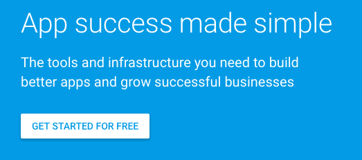
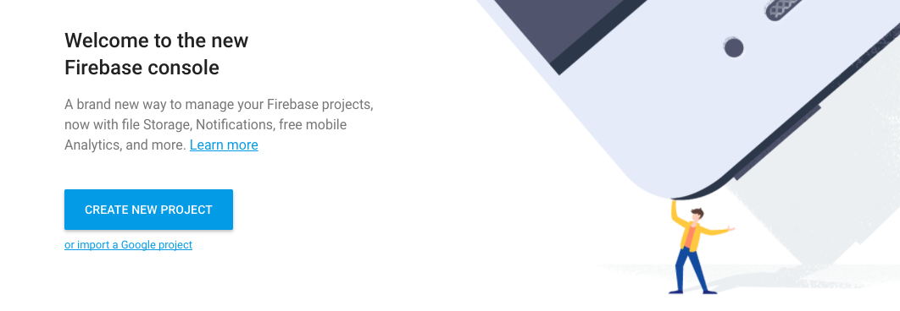
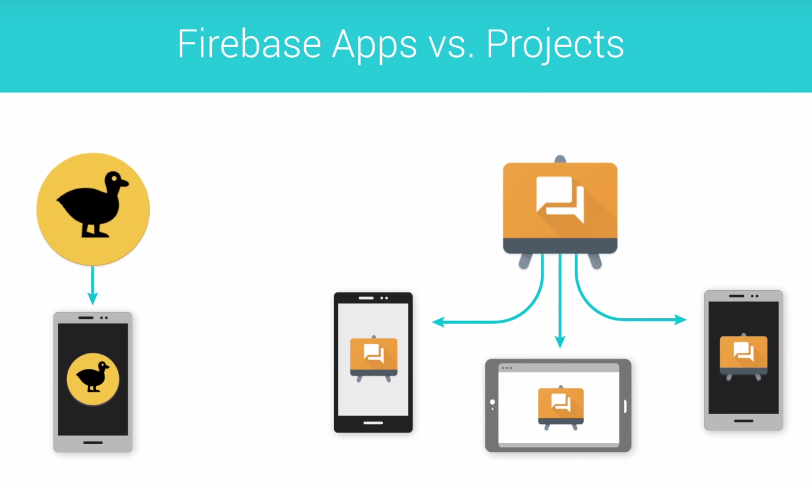
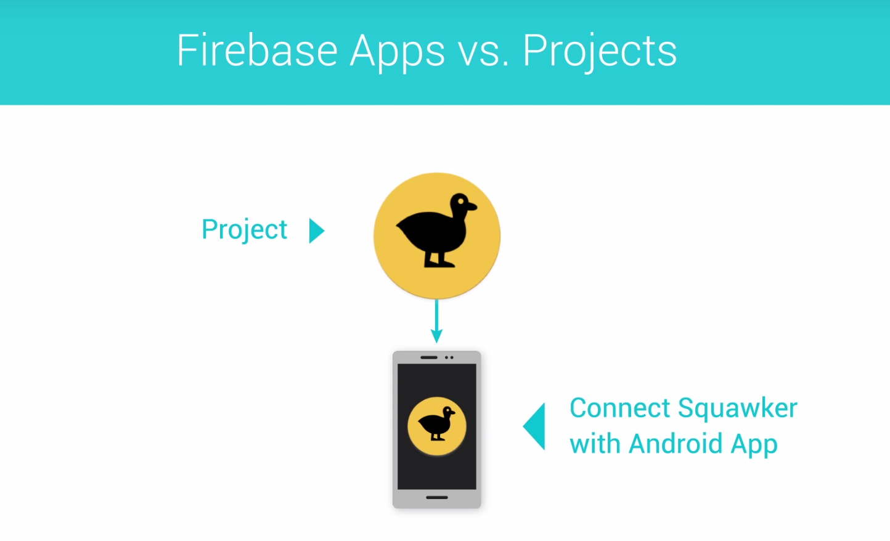

# Lesson 4 - Firebase Cloud Messaging

https://github.com/udacity/AdvancedAndroid_Squawker
## Polling vs Pushing

Squawker and a simple chat app are both examples of applications where updates may occur at any time and where it is important that users receive these updates in close to real time. Therefore, they are great candidates for implementing pushing.

## Introduction to FCM

Pushing is great when you need real time updates and want to be kindto your battery. 

## Overview of the Starting Code

The **following_squawker.xml** file is the one which generates the preferences and you would need a new `SwitchPreferenceCompat` preference for the new instructor. For that preference, you would need new strings in the **strings.xml** file, including the `key` string, which would be `key_<your name>`. In the **SquawkContract**, you’d then make a new constant for the new instructor key, and add it to the list you search through for the `createSelectionForCurrentFollowers` method. Finally, the **SquawkAdapter** would need to be changed to accommodate showing your profile picture.

## What is Firebase

Make an Account

Got to [firebase.google.com](https://firebase.google.com/) and click on the **Get Started For Free** button seen below.

If you are not signed in to a Google account, You will be prompted to sign in or to create a new Google account. Follow the instructions. Once you are signed in, you should be able to click the **Get Started For Free** button and see a page that looks like this.

 

You'll be creating a new Firebase Project soon, but do not press that button yet! Instead, watch the next video to learn more.

### Android and Firebase

Firebase contains a lot of features (many of which are free) which I don't have time to cover here. They include:

- Analytics - Tons of data about your apps users and usage
- Authentication - User authentication which includes email/password, Facebook, Twitter, Github and Google Sign-In
- Realtime Database - NoSQL database which automagically syncs with all devices with the app downloaded
- Storage - Space and SDKs to allow users to upload user generated content
- Hosting - Production grade hosting
- Test Lab - Test your app on multiple phone generations and devices
- Crash Reporting - Records and reports when your app crashes for users
- Notifications - This is part of FCM and we'll be talking more about this
- Remote Config - Customize your app on the fly or run A/B tests with ease
- App Indexing - Drive organic search traffic to your app
- Dynamic Links - Send users to a screen in your app using a link
- Invites - Allow users to invite each other to your app
- AdWords - Run advertisement campaigns to get more app users

More information about these features and links out to documentation can be found [here](https://firebase.google.com/products/).

If you're interested in learning about Android and Firebase, consider taking Udacity's [Firebase in a Weekend](https://eu.udacity.com/course/firebase-in-a-weekend-by-google-android--ud0352) course for Android. The class is free and walks you through the creation of a real time chat app with user accounts, photo sharing and more, using Firebase as a backend.

## Make a New Firebase Project

