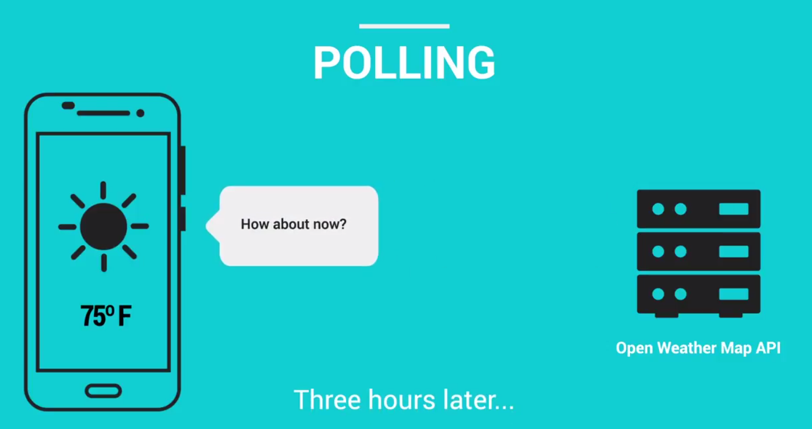
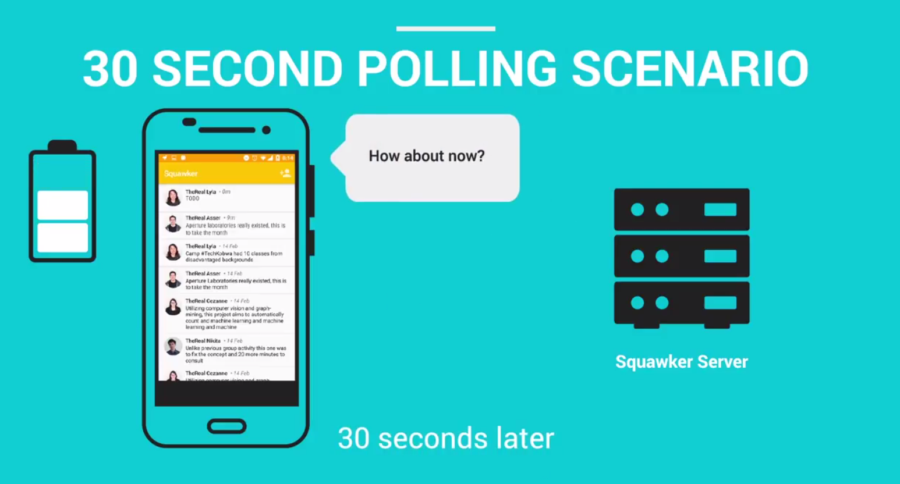
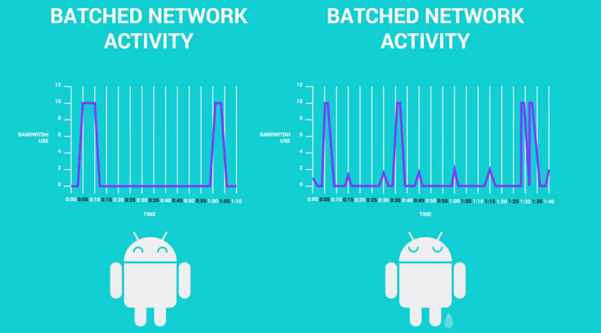
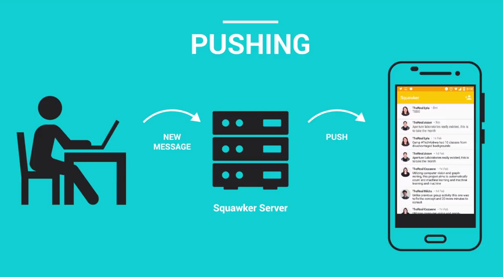
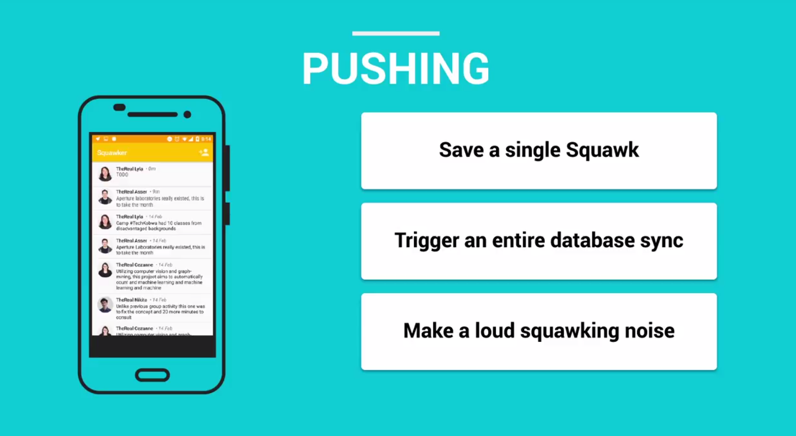
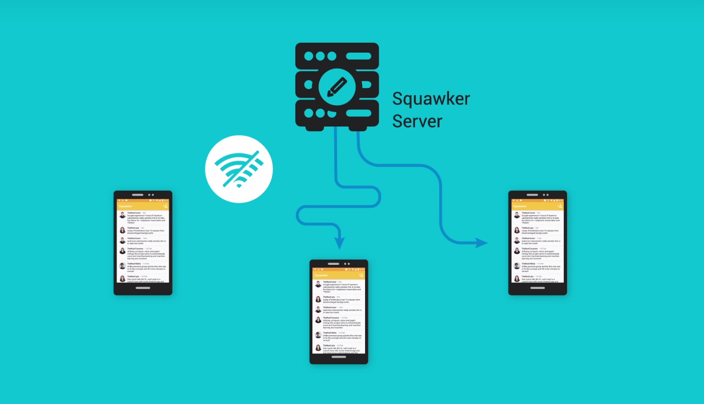
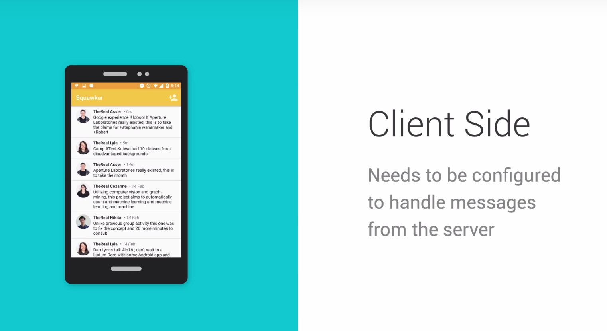
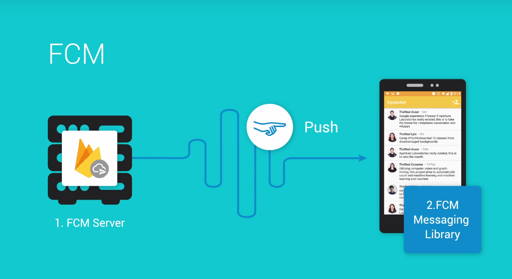
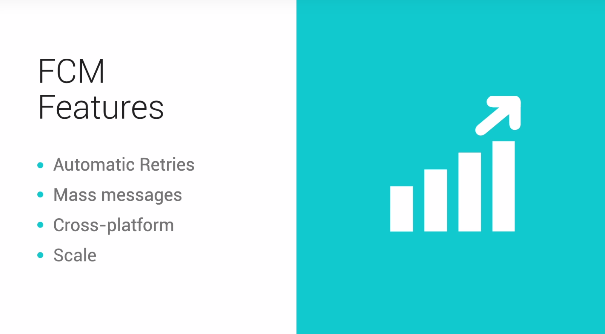

# Lesson 4 - Firebase Cloud Messaging

## Polling vs Pushing

Squawker and a simple chat app are both examples of applications where updates may occur at any time and where it is important that users receive these updates in close to real time. Therefore, they are great candidates for implementing pushing.

## Introduction to FCM

Pushing is great when you need real time updates and want to be kindto your battery. 

## Overview of the Starting Code

