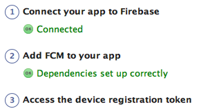
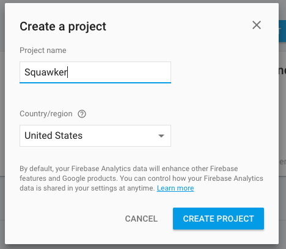
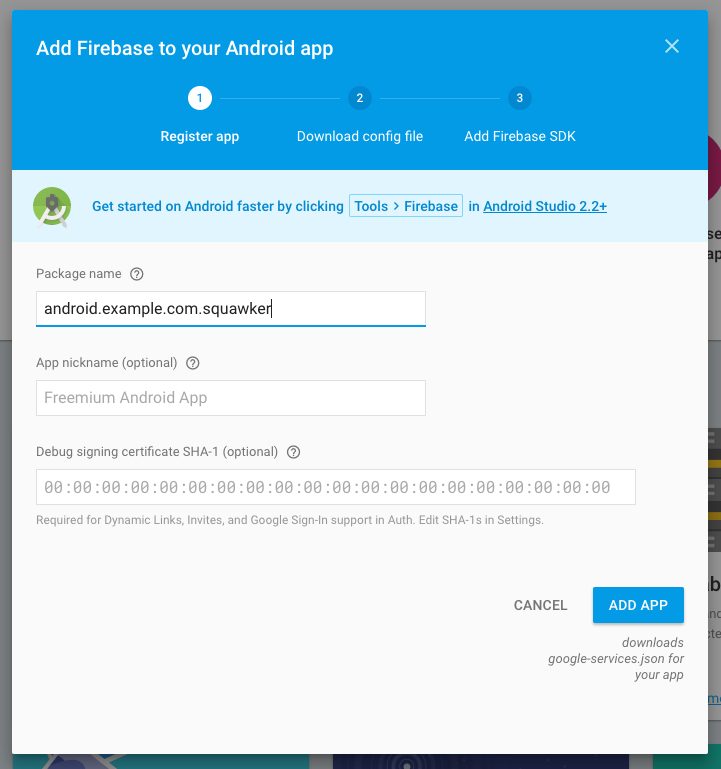
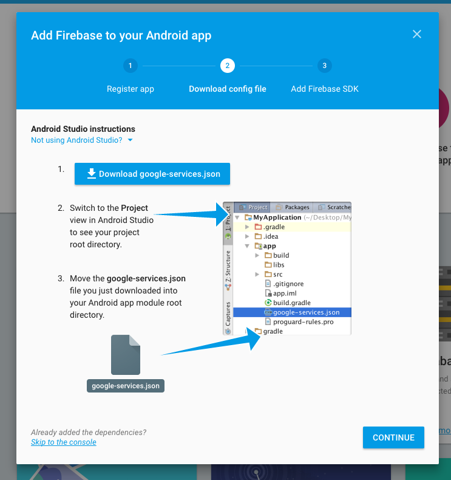
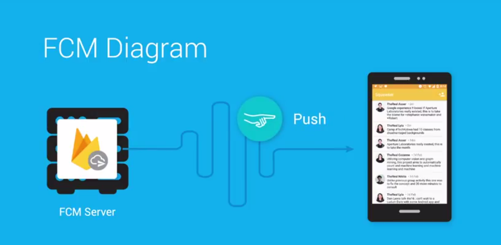
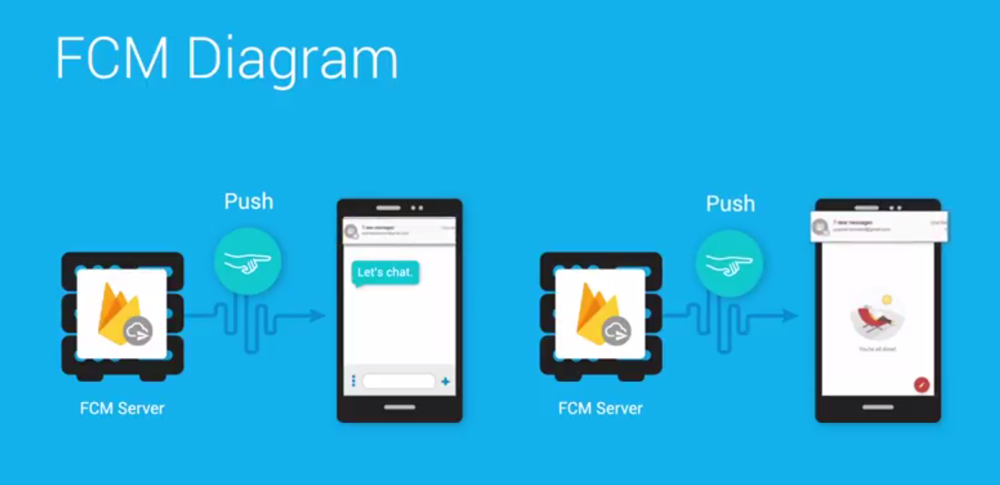
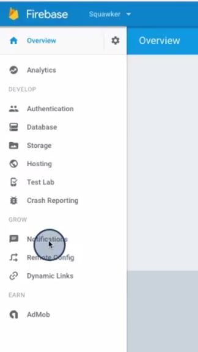
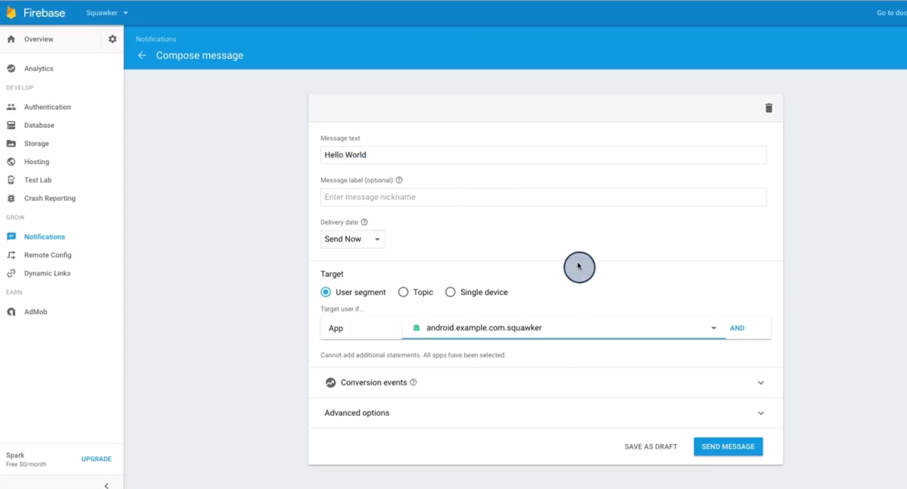
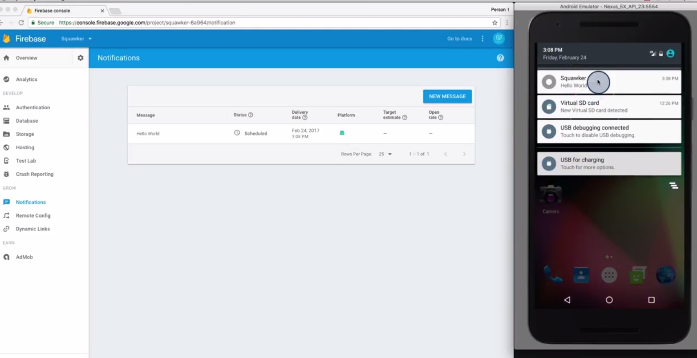

# Lesson 4 - Firebase Cloud Messaging

https://github.com/udacity/AdvancedAndroid_Squawker
## Polling vs Pushing


Squawker and a simple chat app are both examples of applications where updates may occur at any time and where it is important that users receive these updates in close to real time. Therefore, they are great candidates for implementing pushing.

## Introduction to FCM

Pushing is great when you need real time updates and want to be kindto your battery. 


## Overview of the Starting Code

The **following_squawker.xml** file is the one which generates the preferences and you would need a new `SwitchPreferenceCompat` preference for the new instructor. For that preference, you would need new strings in the **strings.xml** file, including the `key` string, which would be `key_<your name>`. In the **SquawkContract**, you’d then make a new constant for the new instructor key, and add it to the list you search through for the `createSelectionForCurrentFollowers` method. Finally, the **SquawkAdapter** would need to be changed to accommodate showing your profile picture.

## What is Firebase

Make an Account

Got to [firebase.google.com](https://firebase.google.com/) and click on the **Get Started For Free** button seen below.


If you are not signed in to a Google account, You will be prompted to sign in or to create a new Google account. Follow the instructions. Once you are signed in, you should be able to click the **Get Started For Free** button and see a page that looks like this.

 

You'll be creating a new Firebase Project soon, but do not press that button yet! Instead, watch the next video to learn more.

### Android and Firebase

Firebase contains a lot of features (many of which are free) which I don't have time to cover here. They include:

- Analytics - Tons of data about your apps users and usage
- Authentication - User authentication which includes email/password, Facebook, Twitter, Github and Google Sign-In
- Realtime Database - NoSQL database which automagically syncs with all devices with the app downloaded
- Storage - Space and SDKs to allow users to upload user generated content
- Hosting - Production grade hosting
- Test Lab - Test your app on multiple phone generations and devices
- Crash Reporting - Records and reports when your app crashes for users
- Notifications - This is part of FCM and we'll be talking more about this
- Remote Config - Customize your app on the fly or run A/B tests with ease
- App Indexing - Drive organic search traffic to your app
- Dynamic Links - Send users to a screen in your app using a link
- Invites - Allow users to invite each other to your app
- AdWords - Run advertisement campaigns to get more app users

More information about these features and links out to documentation can be found [here](https://firebase.google.com/products/).

If you're interested in learning about Android and Firebase, consider taking Udacity's [Firebase in a Weekend](https://eu.udacity.com/course/firebase-in-a-weekend-by-google-android--ud0352) course for Android. The class is free and walks you through the creation of a real time chat app with user accounts, photo sharing and more, using Firebase as a backend.

## Make a New Firebase Project


## Connect Firebase and the SquawkerApp

### The Automated Way

There are two ways to complete this exercise. I suggest the "manual way" (which is described below) so that you clearly know what you are changing. That said, if you have **Android Studio version 2.2 or above** and would like to do a more automated process, you can follow the [instructions here](https://firebase.google.com/docs/android/setup#use_the_firebase_assistant). Note that if you follow the automated directions, you **only** need to do the first two steps: "Connect your app to Firebase" and "Add FCM to your app". You should **not** do step 3, which is "Access the Device Registration token".



### The Manual Way (Recommended)

Otherwise, let's manually configure Firebase! Creating a new project is very easy, so let's do that first.

### Create a new Firebase Project

**Step 1** Go to the Firebase Console and click on **Create a new Project**.

 

**Step 2** Name your project **Squawker**



And that's it! You've created a Firebase project for Squawker. Now it's time to create a Firebase "app" for that project and attach it to your Squakwer app.

### Connect the Squawker Android App to the Server

**Step 1** Select **Add Firebase** to your **Android App**


**Step 2** Enter the Squawker package into the dialog. It is `android.example.com.squawker`. You don't need a SHA key because we are not using Firebase features which require it. You also do not need the app nickname, though feel free to add one if you'd like.



**Step 3** Follow the instructions to download the `google-service.json` config file and save it in Squawker's **app** directory. This configuration file is what tells Squawker what Firebase server instance to connect to online. It is specific to the Firebase "app" you just created. If you ever accidentally delete the `google-service.json `file, you can redownload it, by going to the app **Settings**.



**Step 4** Now you'll add the Firebase SDK. Follow the instructions to add the correct gradle dependencies. The instructions will appear in a dialog, they can also be found [here](https://firebase.google.com/docs/android/setup#manually_add_firebase).

**Step 5** You need to also add the SDK specifically for FCM. In your `app/build.gradle` file, add the following library:

```com.google.firebase:firebase-messaging:10.2.0```

## Send your First FCM Message
[Firebase Console](https://console.firebase.google.com/).









If the app is in the **background** (only):


If You're Having Trouble

If you properly sent the message, you should see a notification on your phone. If not, check that Squawker is in the background, and that you're reliably connected to the internet. Also make sure that you included the FCM library in the last exercise.

## Introduction to Message Data


