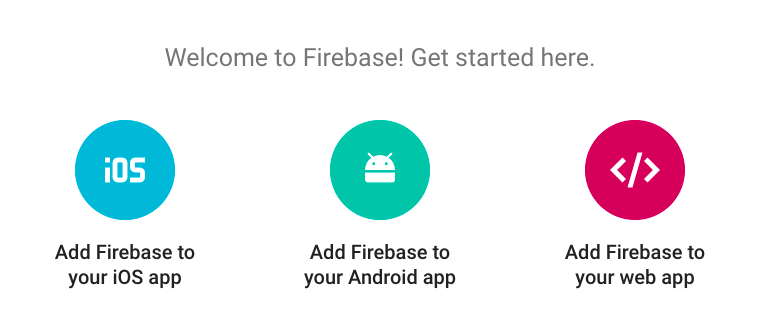

# Lesson 4 - Firebase Cloud Messaging

https://github.com/udacity/AdvancedAndroid_Squawker
## Polling vs Pushing


Squawker and a simple chat app are both examples of applications where updates may occur at any time and where it is important that users receive these updates in close to real time. Therefore, they are great candidates for implementing pushing.

## Introduction to FCM

Pushing is great when you need real time updates and want to be kindto your battery. 


## Overview of the Starting Code

The **following_squawker.xml** file is the one which generates the preferences and you would need a new `SwitchPreferenceCompat` preference for the new instructor. For that preference, you would need new strings in the **strings.xml** file, including the `key` string, which would be `key_<your name>`. In the **SquawkContract**, you’d then make a new constant for the new instructor key, and add it to the list you search through for the `createSelectionForCurrentFollowers` method. Finally, the **SquawkAdapter** would need to be changed to accommodate showing your profile picture.

## What is Firebase

Make an Account

Got to [firebase.google.com](https://firebase.google.com/) and click on the **Get Started For Free** button seen below.


If you are not signed in to a Google account, You will be prompted to sign in or to create a new Google account. Follow the instructions. Once you are signed in, you should be able to click the **Get Started For Free** button and see a page that looks like this.

 

You'll be creating a new Firebase Project soon, but do not press that button yet!

### Android and Firebase

Firebase contains a lot of features (many of which are free) which I don't have time to cover here. They include:

- Analytics - Tons of data about your apps users and usage
- Authentication - User authentication which includes email/password, Facebook, Twitter, Github and Google Sign-In
- Realtime Database - NoSQL database which automagically syncs with all devices with the app downloaded
- Storage - Space and SDKs to allow users to upload user generated content
- Hosting - Production grade hosting
- Test Lab - Test your app on multiple phone generations and devices
- Crash Reporting - Records and reports when your app crashes for users
- Notifications - This is part of FCM and we'll be talking more about this
- Remote Config - Customize your app on the fly or run A/B tests with ease
- App Indexing - Drive organic search traffic to your app
- Dynamic Links - Send users to a screen in your app using a link
- Invites - Allow users to invite each other to your app
- AdWords - Run advertisement campaigns to get more app users

More information about these features and links out to documentation can be found [here](https://firebase.google.com/products/).

If you're interested in learning about Android and Firebase, consider taking Udacity's [Firebase in a Weekend](https://eu.udacity.com/course/firebase-in-a-weekend-by-google-android--ud0352) course for Android. The class is free and walks you through the creation of a real time chat app with user accounts, photo sharing and more, using Firebase as a backend.

## Make a New Firebase Project


## Connect Firebase and the SquawkerApp

### The Automated Way

There are two ways to complete this exercise. I suggest the "manual way" (which is described below) so that you clearly know what you are changing. That said, if you have **Android Studio version 2.2 or above** and would like to do a more automated process, you can follow the [instructions here](https://firebase.google.com/docs/android/setup#use_the_firebase_assistant). Note that if you follow the automated directions, you **only** need to do the first two steps: "Connect your app to Firebase" and "Add FCM to your app". You should **not** do step 3, which is "Access the Device Registration token".


### The Manual Way (Recommended)

Otherwise, let's manually configure Firebase! Creating a new project is very easy, so let's do that first.

### Create a new Firebase Project

**Step 1** Go to the Firebase Console and click on **Create a new Project**.

 

**Step 2** Name your project **Squawker**


And that's it! You've created a Firebase project for Squawker. Now it's time to create a Firebase "app" for that project and attach it to your Squakwer app.

### Connect the Squawker Android App to the Server

**Step 1** Select **Add Firebase** to your **Android App**



**Step 2** Enter the Squawker package into the dialog. It is `android.example.com.squawker`. You don't need a SHA key because we are not using Firebase features which require it. You also do not need the app nickname, though feel free to add one if you'd like.


**Step 3** Follow the instructions to download the `google-service.json` config file and save it in Squawker's **app** directory. This configuration file is what tells Squawker what Firebase server instance to connect to online. It is specific to the Firebase "app" you just created. If you ever accidentally delete the `google-service.json `file, you can redownload it, by going to the app **Settings**.


**Step 4** Now you'll add the Firebase SDK. Follow the instructions to add the correct gradle dependencies. The instructions will appear in a dialog, they can also be found [here](https://firebase.google.com/docs/android/setup#manually_add_firebase).

**Step 5** You need to also add the SDK specifically for FCM. In your `app/build.gradle` file, add the following library:

```com.google.firebase:firebase-messaging:10.2.0```

https://stackoverflow.com/questions/46537373/unresolved-package-generated-in-androidmanifest-xml/47384765#47384765

## Send your First FCM Message
[Firebase Console](https://console.firebase.google.com/).


If the app is in the **background** (only):


If You're Having Trouble

If you properly sent the message, you should see a notification on your phone. If not, check that Squawker is in the background, and that you're reliably connected to the internet. Also make sure that you included the FCM library in the last exercise.

## Introduction to Message Data


In MainActivity:
```java
@Override
protected void onCreate(Bundle savedInstanceState) {
    ...

    // Gets the extra data from the intent that started the activity. For *notification*
    // messages, this will contain key value pairs stored in the *data* section of the message.
    Bundle extras = getIntent().getExtras();
    // Checks if the extras exist and if the key "test" from our FCM message is in the intent
    if (extras != null && extras.containsKey("test")) {
        // If the key is there, print out the value of "test"
        Log.d(LOG_TAG, "Contains: " + extras.getString("test"));
    }

}
```


## Sending to a Specific Phone

You can use the steps and example code mentioned in the video and linked [here](https://firebase.google.com/docs/cloud-messaging/android/client#manifest) to help.

In the console, select Target > **Single Device**


## Notification vs Data Messages


Server key: 


## Create Firebase Messaging Service

[Squawker server](https://squawkerfcmserver.udacity.com/)


Create a service that extends FirebaseMessaginService

In the new service, override the method onMessageReceived, add the Squawk to the database and show a notification

```java
/**
 * Listens for squawk FCM messages both in the background and the foreground and responds
 * appropriately
 * depending on type of message
 */
public class SquawkFirebaseMessageService extends FirebaseMessagingService {

    private static final String JSON_KEY_AUTHOR = SquawkContract.COLUMN_AUTHOR;
    private static final String JSON_KEY_AUTHOR_KEY = SquawkContract.COLUMN_AUTHOR_KEY;
    private static final String JSON_KEY_MESSAGE = SquawkContract.COLUMN_MESSAGE;
    private static final String JSON_KEY_DATE = SquawkContract.COLUMN_DATE;

    private static final int NOTIFICATION_MAX_CHARACTERS = 30;
    private static String LOG_TAG = SquawkFirebaseMessageService.class.getSimpleName();

    /**
     * Called when message is received.
     *
     * @param remoteMessage Object representing the message received from Firebase Cloud Messaging
     */
    @Override
    public void onMessageReceived(RemoteMessage remoteMessage) {
        // There are two types of messages data messages and notification messages. Data messages
        // are handled
        // here in onMessageReceived whether the app is in the foreground or background. Data
        // messages are the type
        // traditionally used with FCM. Notification messages are only received here in
        // onMessageReceived when the app
        // is in the foreground. When the app is in the background an automatically generated
        // notification is displayed.
        // When the user taps on the notification they are returned to the app. Messages
        // containing both notification
        // and data payloads are treated as notification messages. The Firebase console always
        // sends notification
        // messages. For more see: https://firebase.google.com/docs/cloud-messaging/concept-options\

        // The Squawk server always sends just *data* messages, meaning that onMessageReceived when
        // the app is both in the foreground AND the background

        Log.d(LOG_TAG, "From: " + remoteMessage.getFrom());

        // Check if message contains a data payload.

        Map<String, String> data = remoteMessage.getData();

        if (data.size() > 0) {
            Log.d(LOG_TAG, "Message data payload: " + data);

            // Send a notification that you got a new message
            sendNotification(data);
            insertSquawk(data);

        }
    }

    /**
     * Inserts a single squawk into the database;
     *
     * @param data Map which has the message data in it
     */
    private void insertSquawk(final Map<String, String> data) {

        // Database operations should not be done on the main thread
        AsyncTask<Void, Void, Void> insertSquawkTask = new AsyncTask<Void, Void, Void>() {

            @Override
            protected Void doInBackground(Void... voids) {
                ContentValues newMessage = new ContentValues();
                newMessage.put(SquawkContract.COLUMN_AUTHOR, data.get(JSON_KEY_AUTHOR));
                newMessage.put(SquawkContract.COLUMN_MESSAGE, data.get(JSON_KEY_MESSAGE).trim());
                newMessage.put(SquawkContract.COLUMN_DATE, data.get(JSON_KEY_DATE));
                newMessage.put(SquawkContract.COLUMN_AUTHOR_KEY, data.get(JSON_KEY_AUTHOR_KEY));
                getContentResolver().insert(SquawkProvider.SquawkMessages.CONTENT_URI, newMessage);
                return null;
            }
        };

        insertSquawkTask.execute();
    }


    /**
     * Create and show a simple notification containing the received FCM message
     *
     * @param data Map which has the message data in it
     */
    private void sendNotification(Map<String, String> data) {
        Intent intent = new Intent(this, MainActivity.class);
        intent.addFlags(Intent.FLAG_ACTIVITY_CLEAR_TOP);
        // Create the pending intent to launch the activity
        PendingIntent pendingIntent = PendingIntent.getActivity(this, 0 /* Request code */, intent,
                PendingIntent.FLAG_ONE_SHOT);

        String author = data.get(JSON_KEY_AUTHOR);
        String message = data.get(JSON_KEY_MESSAGE);

        // If the message is longer than the max number of characters we want in our
        // notification, truncate it and add the unicode character for ellipsis
        if (message.length() > NOTIFICATION_MAX_CHARACTERS) {
            message = message.substring(0, NOTIFICATION_MAX_CHARACTERS) + "\u2026";
        }

        Uri defaultSoundUri = RingtoneManager.getDefaultUri(RingtoneManager.TYPE_NOTIFICATION);
        NotificationCompat.Builder notificationBuilder = new NotificationCompat.Builder(this)
                .setSmallIcon(R.drawable.ic_duck)
                .setContentTitle(String.format(getString(R.string.notification_message), author))
                .setContentText(message)
                .setAutoCancel(true)
                .setSound(defaultSoundUri)
                .setContentIntent(pendingIntent);

        NotificationManager notificationManager =
                (NotificationManager) getSystemService(Context.NOTIFICATION_SERVICE);

        notificationManager.notify(0 /* ID of notification */, notificationBuilder.build());
    }
}
```

Add the service to the manifest with an intent filter that catches a com.google.firebase.MESSAGING_EVENT
```xml
 <!-- Id service -->
<service android:name=".fcm.SquawkFirebaseInstanceIdService">
    <intent-filter>
        <action android:name="com.google.firebase.INSTANCE_ID_EVENT" />
    </intent-filter>
</service>

<!-- Service listening for any incoming messages -->
<service android:name=".fcm.SquawkFirebaseMessageService">
    <intent-filter>
        <action android:name="com.google.firebase.MESSAGING_EVENT" />
    </intent-filter>
</service>
```

## Foreground vs Background

With Data Messages, onMessageReceived is triggered when the app is in the foreground or the background.


## Sending to Multiple Devices

Send to Groups:
- device groups 
- topics

### Topics


If you'd like to learn more about device groups, the documentation is [here](https://firebase.google.com/docs/cloud-messaging/android/device-group).

### Sample Code

The code for subscribing and unsubscribing to "country" topics is shown below.
```java
// Subscribing to topics
FirebaseMessaging.getInstance().subscribeToTopic(“japan”);
FirebaseMessaging.getInstance().subscribeToTopic(”usa”);

// Unsubscribing from a topic
FirebaseMessaging.getInstance().unsubscribeFromTopic(“usa”);
```

## Implement Topic Following

In FollowingPreferenceFragment:
- implements
SharedPreferences.OnSharedPreferenceChangeListener
```java
/**
* Triggered when shared preferences changes. This will be triggered when a person is followed
* or un-followed
*
* @param sharedPreferences SharedPreferences file
* @param key               The key of the preference which was changed
*/
@Override
public void onSharedPreferenceChanged(SharedPreferences sharedPreferences, String key) {

Preference preference = findPreference(key);
if (preference != null && preference instanceof SwitchPreferenceCompat) {
    // Get the current state of the switch preference
    boolean isOn = sharedPreferences.getBoolean(key, false);
    if (isOn) {
        // The preference key matches the following key for the associated instructor in
        // FCM. For example, the key for Lyla is key_lyla (as seen in
        // following_squawker.xml). The topic for Lyla's messages is /topics/key_lyla

        // Subscribe
        FirebaseMessaging.getInstance().subscribeToTopic(key);
        Log.d(LOG_TAG, "Subscribing to " + key);
    } else {
        // Un-subscribe
        FirebaseMessaging.getInstance().unsubscribeFromTopic(key);
        Log.d(LOG_TAG, "Un-subscribing to " + key);
    }
}
}
@Override
public void onCreate(Bundle savedInstanceState) {
    super.onCreate(savedInstanceState);
    // Add the shared preference change listener
    getPreferenceScreen().getSharedPreferences()
            .registerOnSharedPreferenceChangeListener(this);
}

@Override
public void onDestroy() {
    super.onDestroy();
    // Remove the shared preference change listener
    getPreferenceScreen().getSharedPreferences()
            .unregisterOnSharedPreferenceChangeListener(this);
}
```
### Preferences lesson

If you need to refresh your memory on how to set up preferences and listen to value changes check out this [lesson](https://classroom.udacity.com/courses/ud851/lessons/1392b674-18b6-4636-b36b-da7d37a319e3/concepts/328e74ec-6533-45f5-906f-3e3d6a09ea1d#) in the first Android course.

To send an Instructor Squawk, you'll need to enter your server key and then you can pick an instructor from the list, as seen below. The following would, trigger the server to send a message from "Lyla", by sending a message from the "key_lyla" topic.


## There's more to learn abour FCM

Where to Go for More

FCM has documentation for both Android and setting up server code:

- The Android documentation is [here](https://firebase.google.com/docs/cloud-messaging/android/client)
- Documentation about how messages are sent from FCM to client is [here](https://firebase.google.com/docs/cloud-messaging/concept-options)
- Detailed information about setting up an FCM server like my [Squawker server](https://squawkerfcmserver.udacity.com/) is here

You can check out [this blog post](https://firebase.googleblog.com/2016/08/sending-notifications-between-android.html) for an example of some Node.js code for setting up an FCM server. The library that I used for the Squawker server is called [fcm-node](https://www.npmjs.com/package/fcm-node).

Finally, as mentioned before, if you're interested in learning more about Android and Firebase, consider taking Udacity's [Firebase in a Weekend course](https://eu.udacity.com/course/firebase-in-a-weekend-by-google-android--ud0352) for Android. The class is free and walks you through the creation of a real time chat app with user accounts, photo sharing and more, using Firebase as a backend.
